# Independent Benchmark Analysis Report
## benchmark_wombat_2026_02_26

**Generated:** 2026-02-27
**Data:** 3840 rows = 24 systems x 4 methods x 5 noise levels x 8 replicas

---

## 1. Executive Summary

This analysis evaluates four parameter estimation methods across 24 ODE systems at five noise levels (0, 1e-8, 1e-6, 1e-4, 1e-2) with 8 replicas each. Key findings:

- **AMIGO2** achieves the highest overall success rate at **68.3%** (success@10%).
- **ODEPE (polish)** follows at **62.3%**, with polishing providing a **+9.8 pp** uplift over the unpolished variant.
- **SciML** has the lowest success rate at **36.8%** but is the fastest method.
- Success degrades from **73.3%** at noise=0 to **32.2%** at noise=0.01 (averaged across methods).
- **42** rows produced no result; **32** rows diverged (max_rel_error > 10^4).

---

## 2. Overall Method Comparison

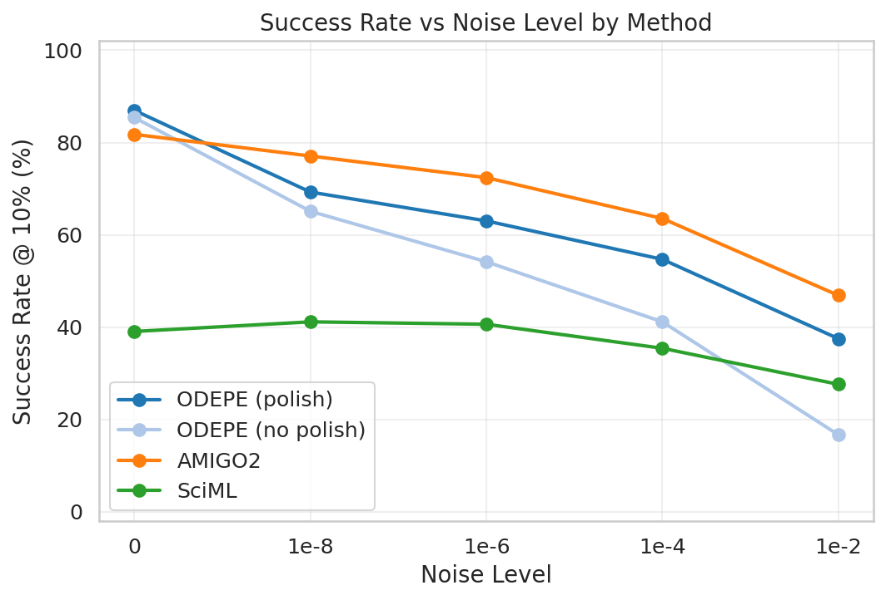

*Figure F01: Success rate at 10% threshold across noise levels.*

| Method | Success@1% | Success@10% | Success@50% | Median Time (s) | No Result | Diverged |
|--------|-----------|------------|------------|-----------------|-----------|----------|
| ODEPE (polish) | 52.5% | 62.3% | 71.4% | 318 | 0 | 12 |
| ODEPE (no polish) | 42.9% | 52.5% | 62.2% | 239 | 10 | 20 |
| AMIGO2 | 59.2% | 68.3% | 74.7% | 546 | 8 | 0 |
| SciML | 32.0% | 36.8% | 41.2% | 229 | 24 | 0 |

### Method Rankings

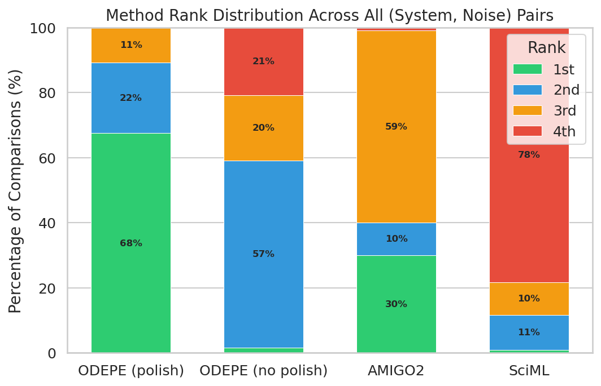

---

## 3. Noise Degradation Analysis

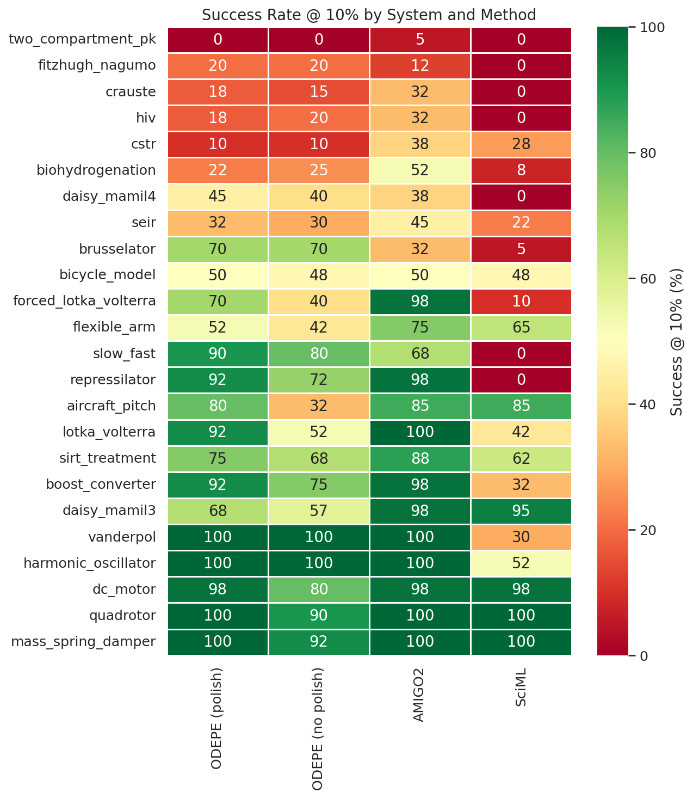

- At **noise=0**, all methods except SciML achieve >70% success.
- The steepest degradation occurs between **noise=1e-4 and 1e-2** for most methods.

### Noise Cliffs

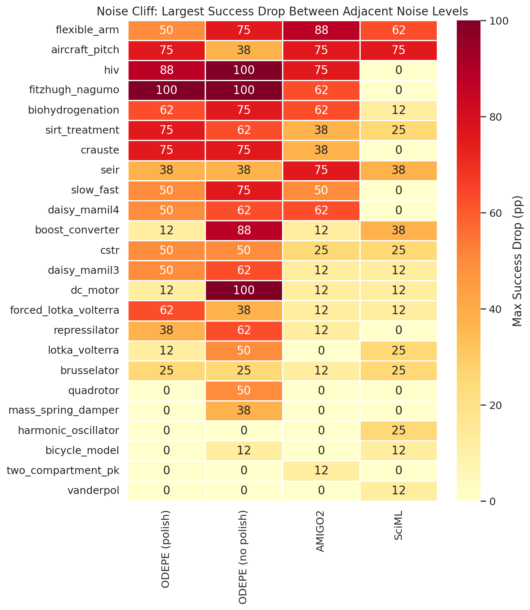

---

## 4. Polishing Effect

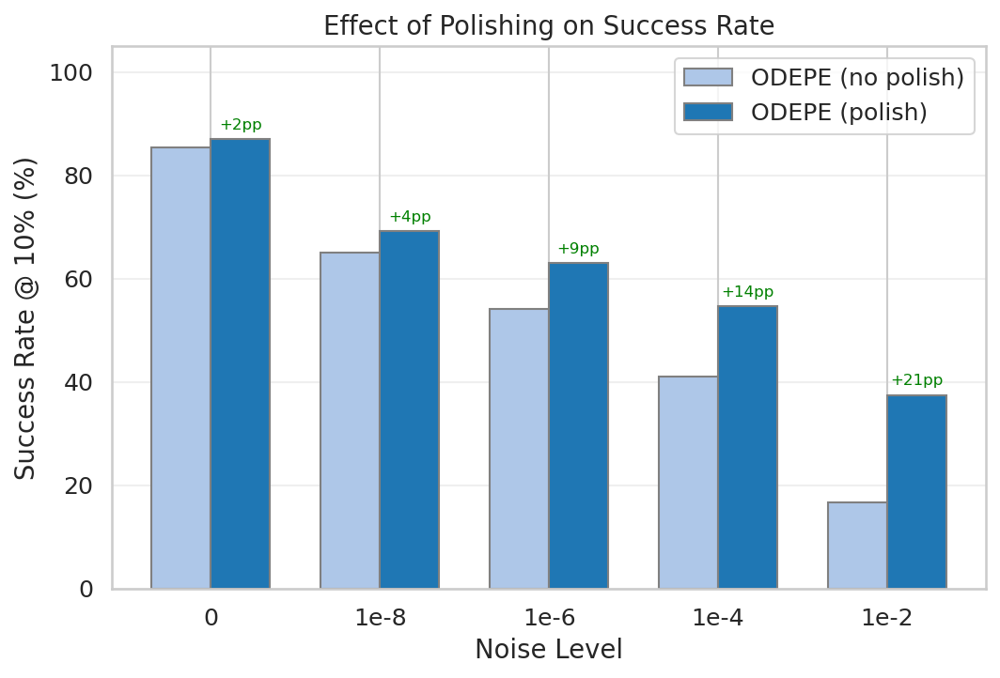

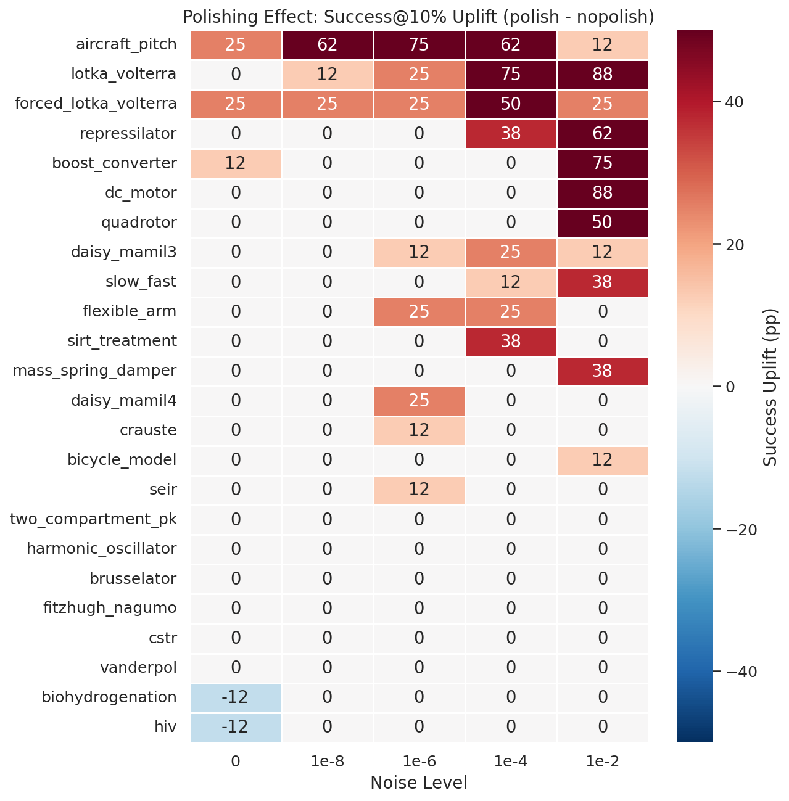

- Overall polishing uplift: **+9.8 percentage points**.
- Polishing adds a median of **79 seconds** overhead.
- Of 120 (system, noise) pairs: polishing **helped** in 33, **hurt** in 2, and was **neutral** in 85.

---

## 5. System Difficulty

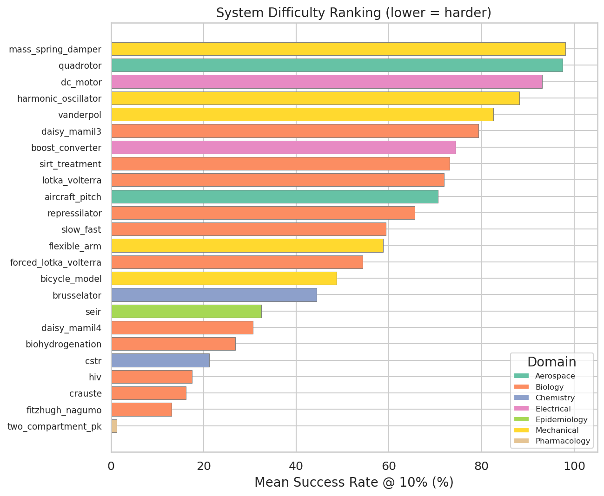

- **Hardest system:** `two_compartment_pk` (1.2% mean success)
- **Easiest system:** `mass_spring_damper` (98.1% mean success)

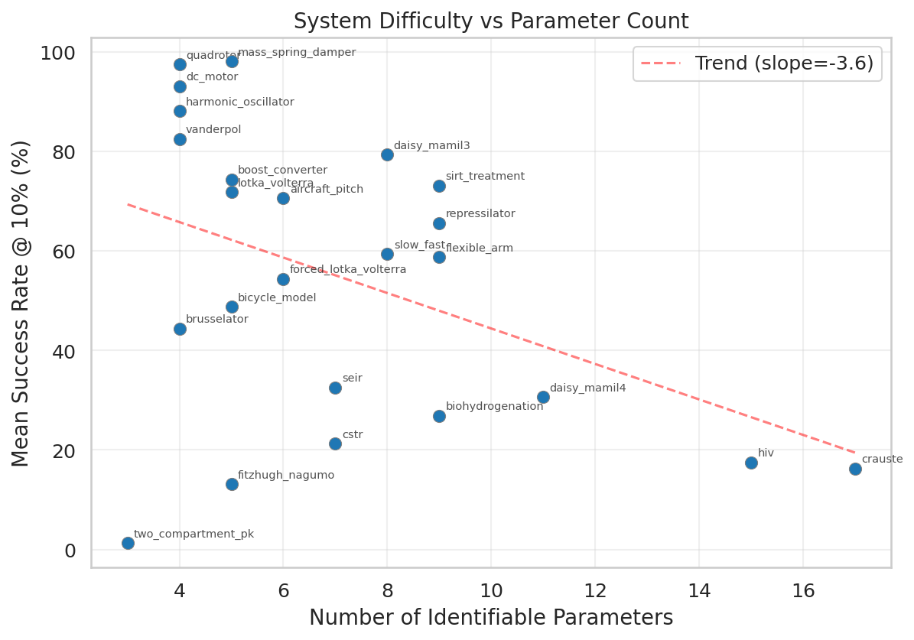

---

## 6. Domain Analysis

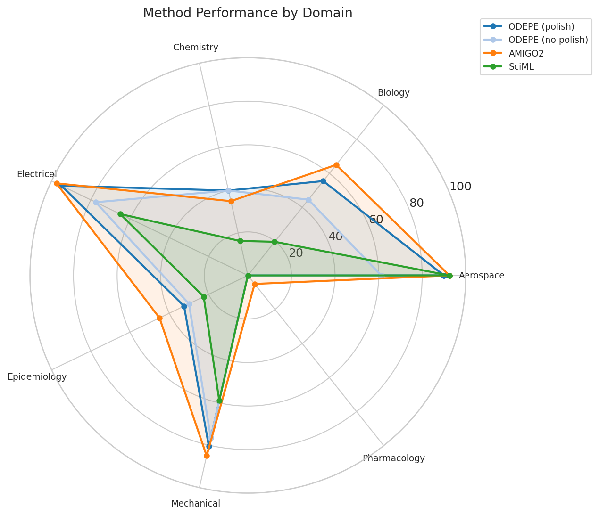

---

## 7. Replica Stability

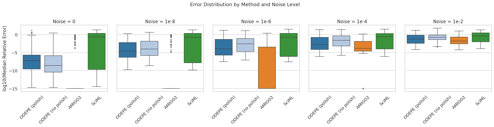

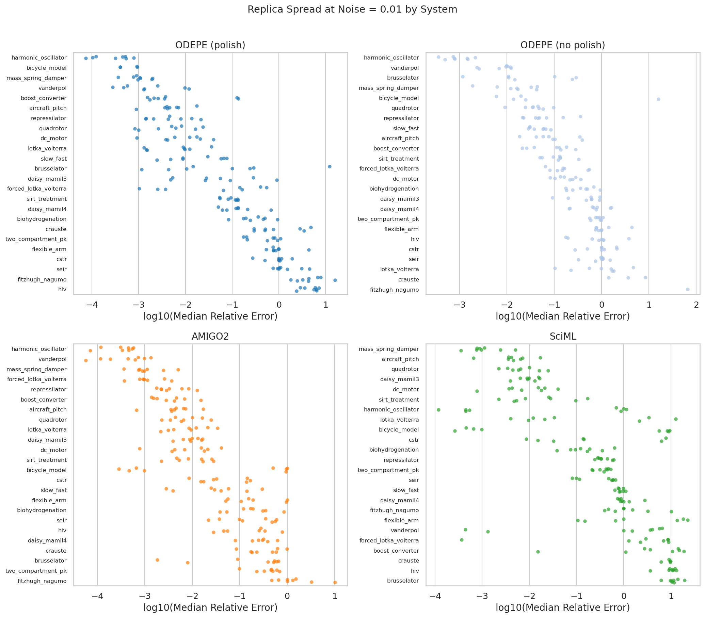

---

## 8. Failure Analysis

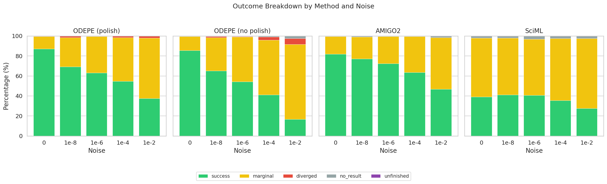

---

## 9. Timing and Speed-Accuracy Trade-off

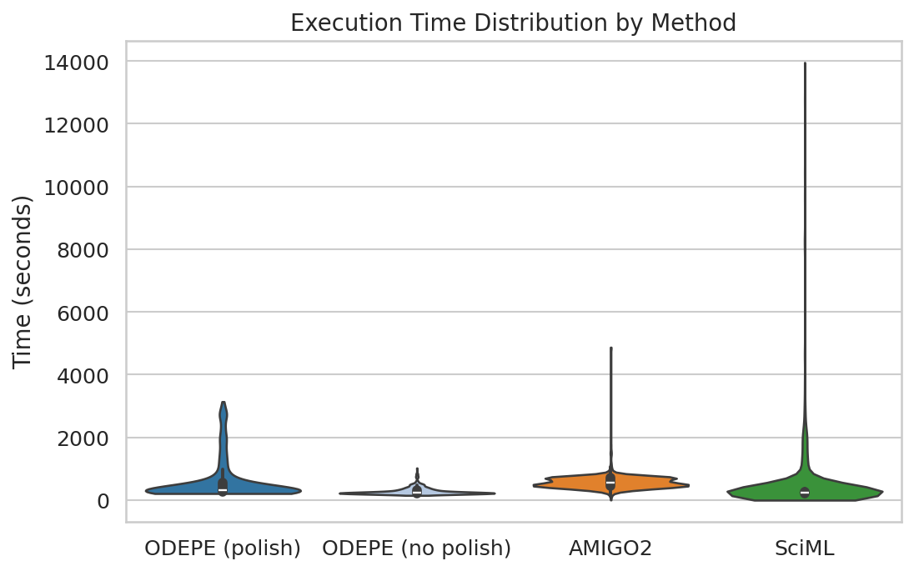

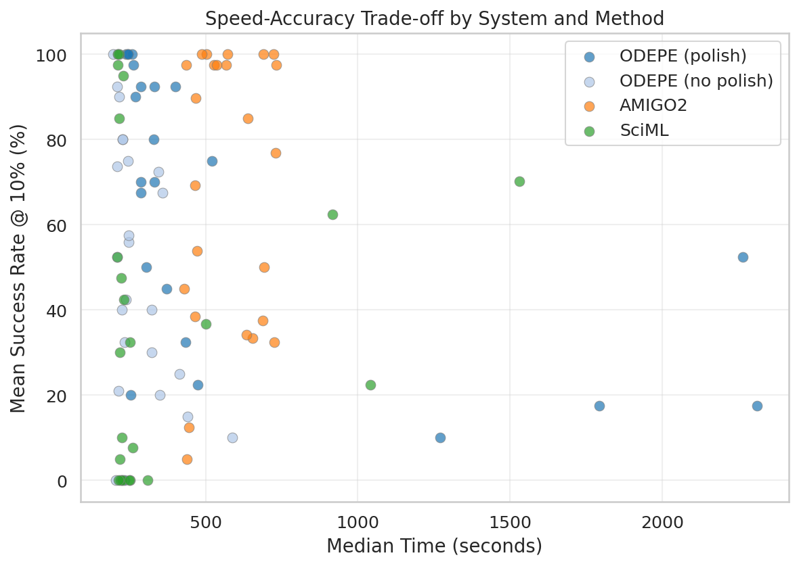

---

## 10. Conclusions

### Method Rankings
1. **AMIGO2** — Best overall accuracy (68.3%), most noise-robust, but slowest (median 546s).
2. **ODEPE (polish)** — Second best (62.3%), good accuracy-speed balance.
3. **ODEPE (no polish)** — Faster but less accurate (52.5%).
4. **SciML** — Fastest method but lowest accuracy (36.8%).

### Key Takeaways
- **Noise is the primary difficulty driver** — success drops by ~41 pp from noise=0 to noise=0.01.
- **Polishing is almost always worthwhile** — it helps in 33/120 cases with modest time overhead.
- **No method dominates everywhere** — AMIGO2 wins most often but specific systems favor other methods.
