# Independent Benchmark Analysis Report
## benchmark_bilby_2026_03_09 (complete)

**Generated:** 2026-03-10
**Data:** 3680 rows = 23 systems x 4 methods x 5 noise levels x 8 replicas
**Noise type:** Additive (bilby config)

---

## 1. Executive Summary

This analysis evaluates four parameter estimation methods across 23 ODE systems at five noise levels (0, 1e-8, 1e-6, 1e-4, 1e-2) with 8 replicas each. Key findings:

- **AMIGO2** achieves the highest overall success rate at **79.1%** (success@10%).
- **ODEPE (polish)** follows at **75.3%**.
- Polishing provides a **+6.1 pp** uplift over the unpolished ODEPE variant.
- **SciML** has the lowest success rate at **42.3%**.
- Success degrades from **81.8%** at noise=0 to **40.5%** at noise=0.01 (averaged across methods).
- **27** rows produced no result; **6** rows diverged (max_rel_error > 10^4).

---

## 2. Overall Method Comparison

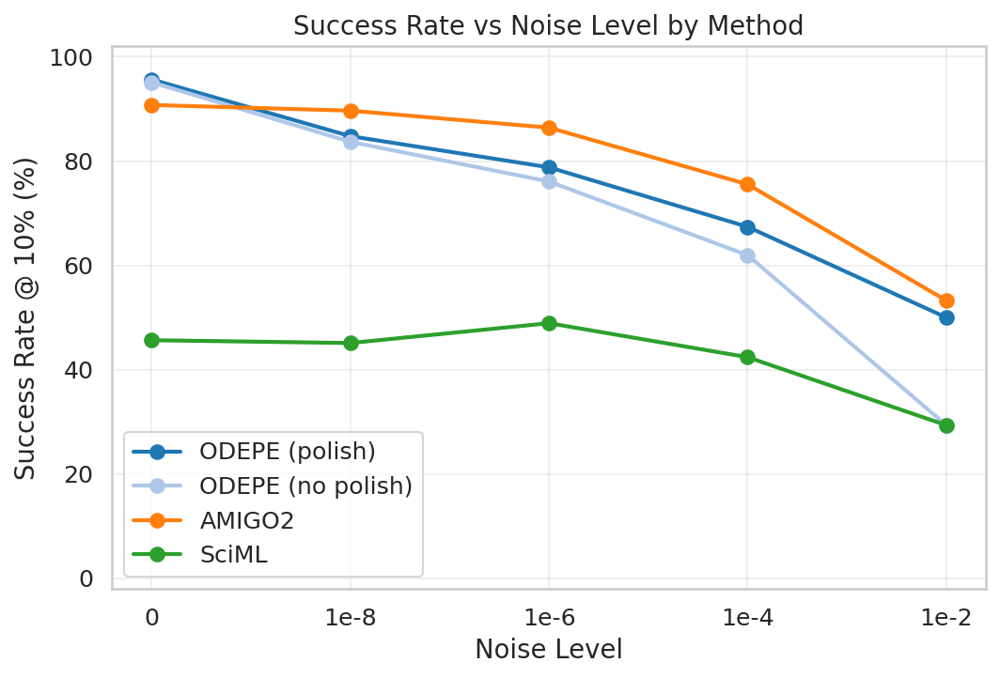

*Figure F01: Success rate at 10% threshold across noise levels.*

| Method | Success@1% | Success@10% | Success@50% | Median Time (s) | No Result | Diverged |
|--------|-----------|------------|------------|-----------------|-----------|----------|
| ODEPE (polish) | 66.0% | 75.3% | 79.8% | 3751 | 0 | 0 |
| ODEPE (no polish) | 58.2% | 69.2% | 77.3% | 3120 | 6 | 6 |
| AMIGO2 | 70.0% | 79.1% | 83.3% | 660 | 0 | 0 |
| SciML | 37.6% | 42.3% | 43.8% | 226 | 21 | 0 |

### Method Rankings

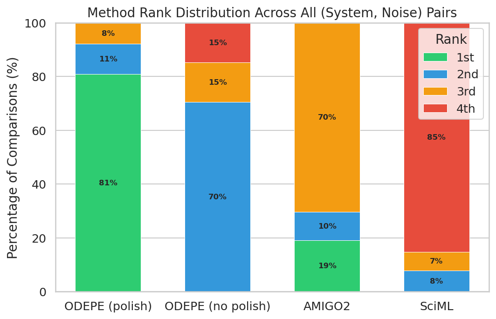

---

## 3. Noise Degradation Analysis

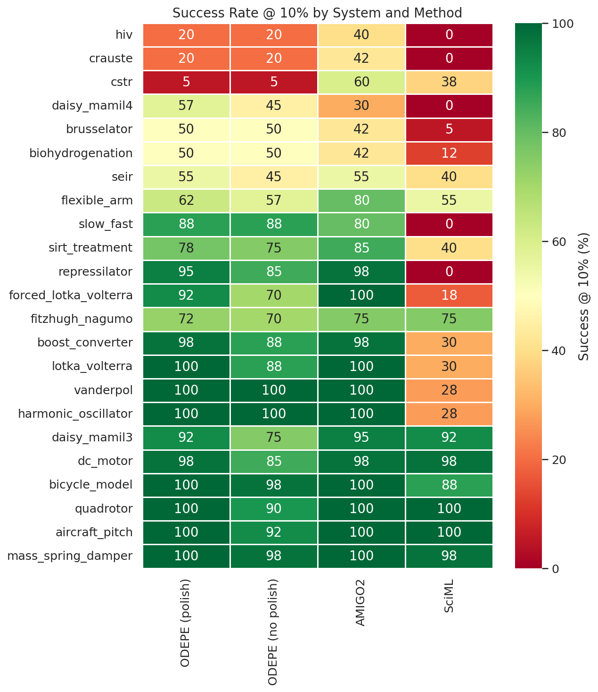

- At **noise=0**, the best methods achieve high success rates.
- The steepest degradation typically occurs between **noise=1e-4 and 1e-2**.

### Noise Cliffs

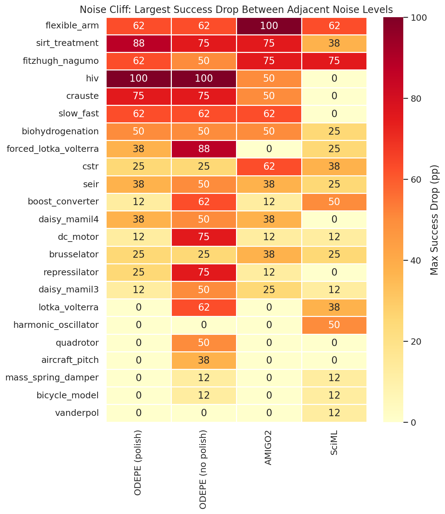

---

## 4. Polishing Effect

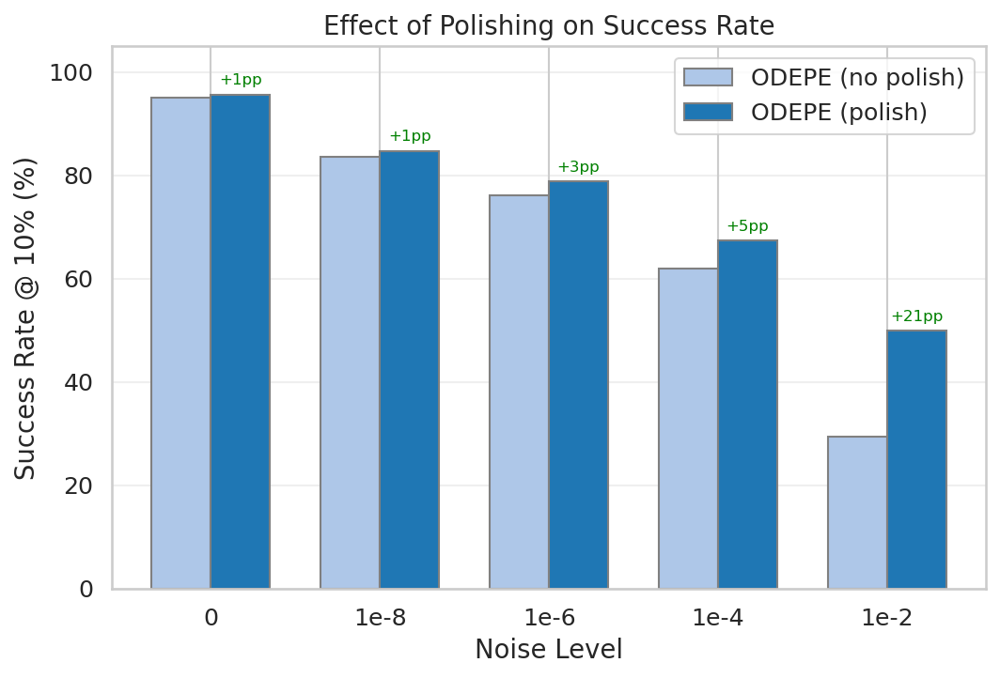

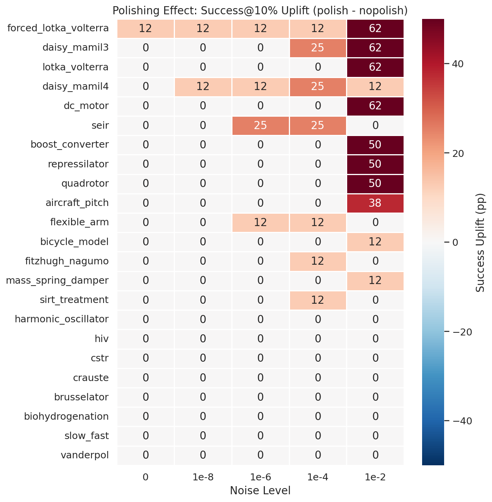

- Overall polishing uplift: **+6.1 percentage points**.
- Polishing adds a median of **631 seconds** overhead.
- Of 115 (system, noise) pairs: polishing **helped** in 25, **hurt** in 0, and was **neutral** in 90.

---

## 5. System Difficulty

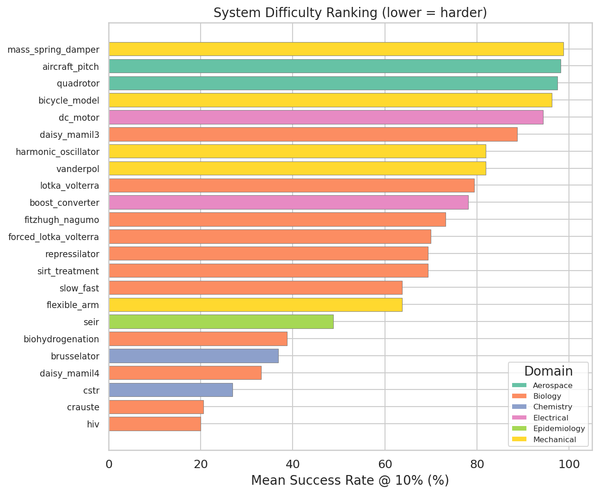

- **Hardest system:** `hiv` (20.0% mean success)
- **Easiest system:** `mass_spring_damper` (98.8% mean success)

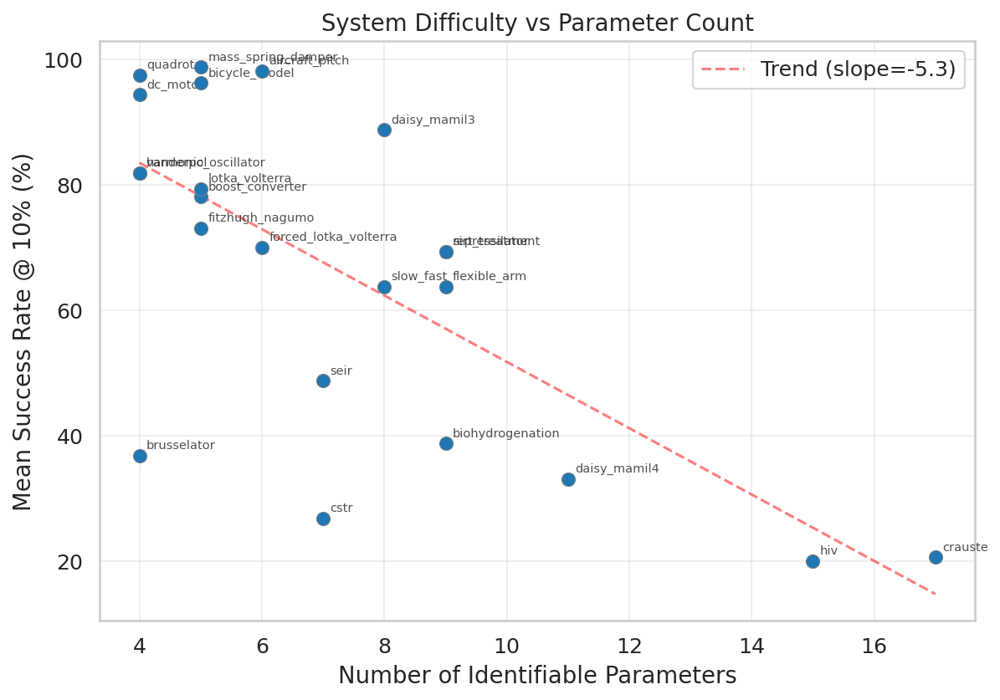

---

## 6. Domain Analysis

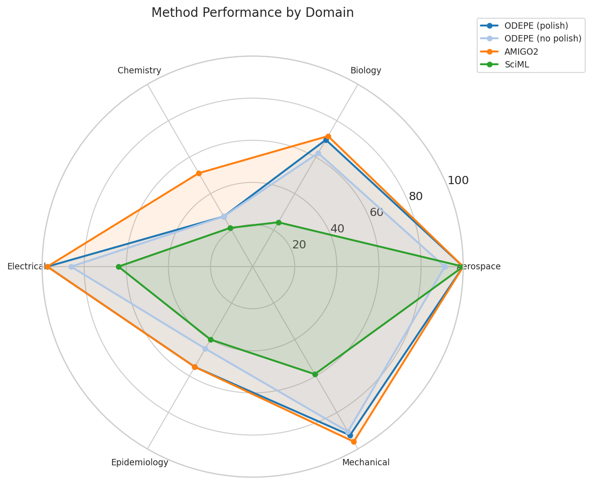

---

## 7. Replica Stability

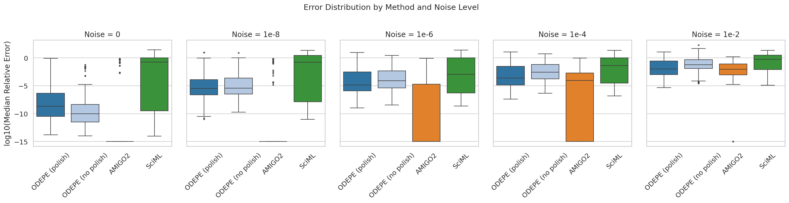

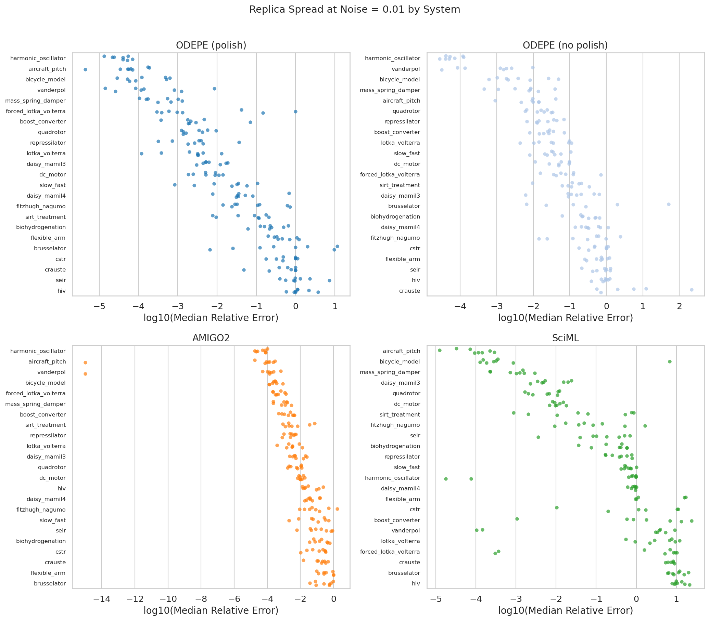

---

## 8. Failure Analysis

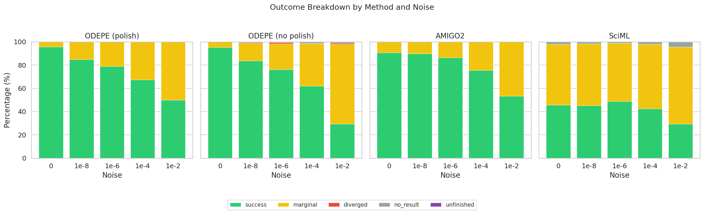

---

## 9. Timing and Speed-Accuracy Trade-off

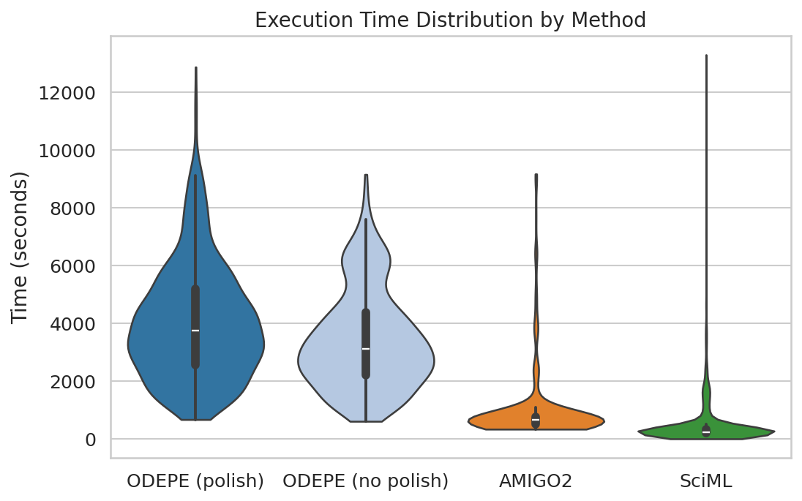

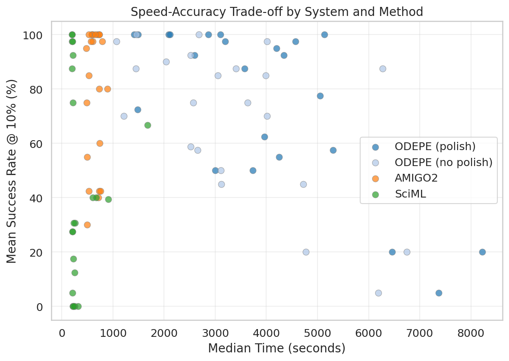

---

## 10. Conclusions

### Method Rankings (data-driven)
1. **AMIGO2** -- 79.1% success@10%, median 660s
2. **ODEPE (polish)** -- 75.3% success@10%, median 3751s
3. **ODEPE (no polish)** -- 69.2% success@10%, median 3120s
4. **SciML** -- 42.3% success@10%, median 226s

### Key Takeaways
- **Noise is the primary difficulty driver** -- success drops by ~41 pp from noise=0 to noise=0.01.
- **Polishing is almost always worthwhile** -- it helps in 25/115 cases with modest time overhead.
- **No method dominates everywhere** -- AMIGO2 wins most often but specific systems favor other methods.
