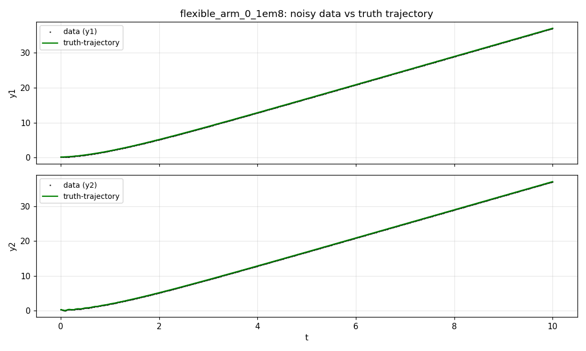
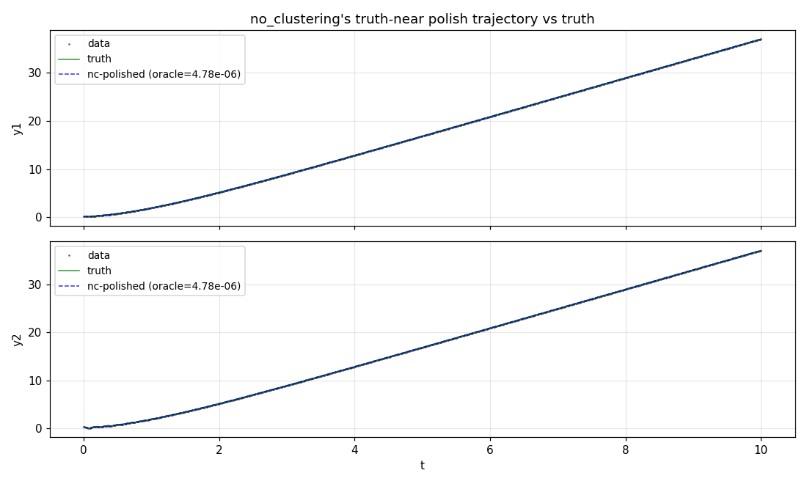
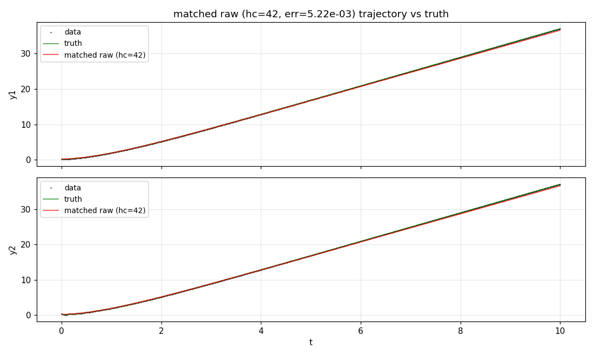
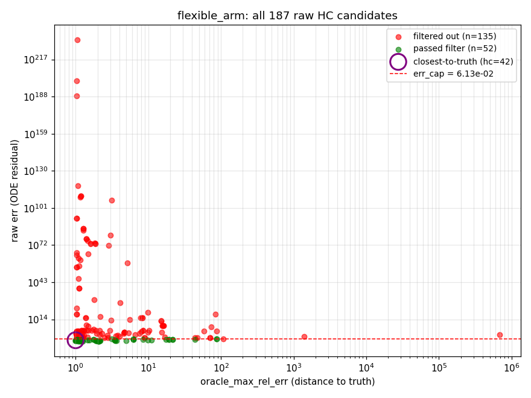
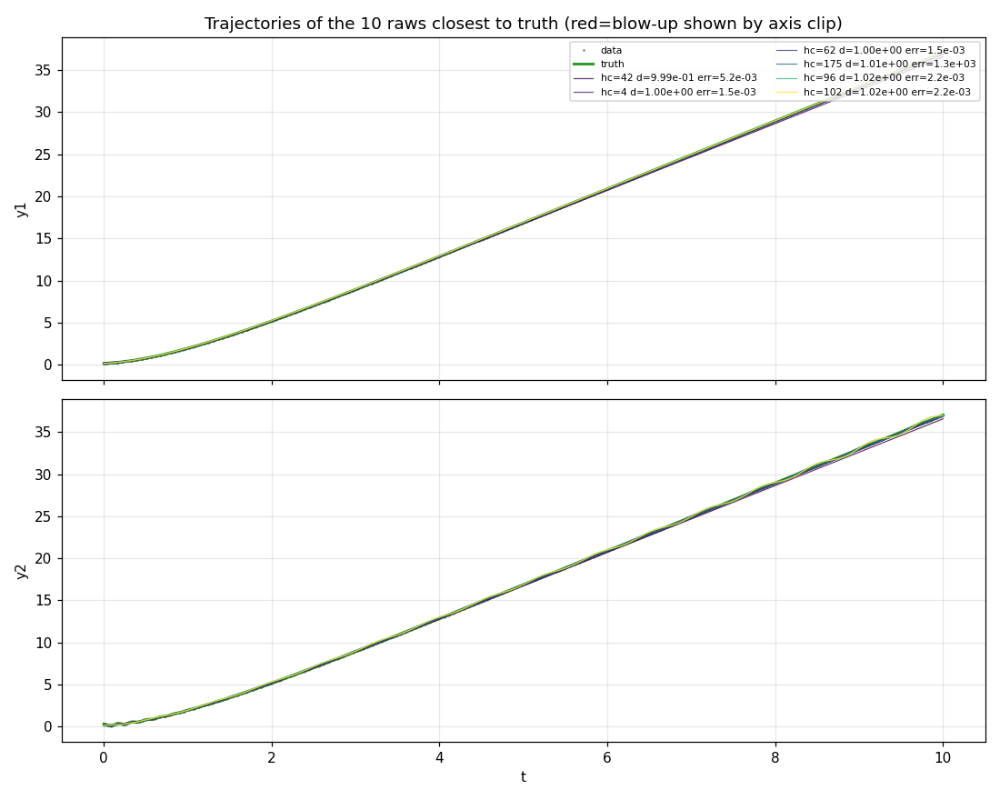
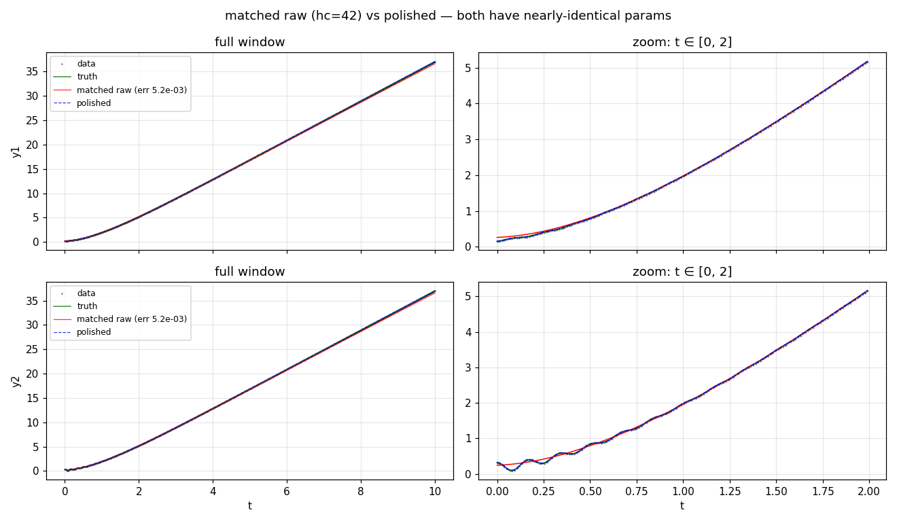

# flexible_arm_0_1em8 — deep dive on the err-filter regression

**Cell**: `flexible_arm_0_1em8` (noise level 1e-8 = essentially noise-free)
**System**: 4-state flexible robotic arm — motor + tip angles + their angular velocities, coupled by a torsional spring (parameter `k`) with rotor inertias (`Jm`,`Jt`) and viscous damping (`bm`,`bt`).

## ODE definition

States: `theta_m, omega_m, theta_t, omega_t`
Parameters: `Jm, Jt, bm, bt, k`
Measurements: `y1 = 0.5*theta_m, y2 = 0.5*theta_t`

ODE:
```
  dtheta_m/dt = omega_m
  domega_m/dt = (0.5 - 0.1*bm*omega_m - 20.0*k*(-0.5*theta_t + 0.5*theta_m)) / (0.1*Jm)
  dtheta_t/dt = omega_t
  domega_t/dt = (-0.05*bt*omega_t - 20.0*k*(0.5*theta_t - 0.5*theta_m)) / (0.05*Jt)
```

## Truth values

| variable | truth |
|---|---:|
| theta_m | 0.311 |
| omega_m | 0.834 |
| theta_t | 0.633 |
| omega_t | 0.45 |
| Jm | 0.535 |
| Jt | 0.14 |
| bm | 0.309 |
| bt | 0.621 |
| k | 0.877 |

Time window: `[0.0, 10.0]` with 750 samples. Noise std (data − truth_trajectory) per channel: {'y1': 1.725629995892747e-07, 'y2': 1.803288242257542e-07}.



## The truth-recovering polished output (from `no_clustering` probe)

The legacy/no-err-filter probe successfully recovered truth. Its best polished output (oracle err = 4.779e-06) had:

| variable | polished | truth | Δ |
|---|---:|---:|---:|
| theta_m | 0.311000 | 0.311000 | +3.578e-08 |
| omega_m | 0.834000 | 0.834000 | +3.825e-07 |
| theta_t | 0.633000 | 0.633000 | +4.189e-08 |
| omega_t | 0.449998 | 0.450000 | -2.151e-06 |
| Jm | 0.535000 | 0.535000 | +5.317e-08 |
| Jt | 0.140000 | 0.140000 | -1.224e-07 |
| bm | 0.309000 | 0.309000 | +4.005e-07 |
| bt | 0.620999 | 0.621000 | -7.997e-07 |
| k | 0.876999 | 0.877000 | -7.407e-07 |



## The matched raw HC (the one that got filtered)

Among the 187 raw HC candidates produced by the new pipeline, the one closest to truth in identifiable-parameter space is:

- **hc_idx**: 42
- **id-space distance to truth (max rel err over states+params)**: `9.993e-01`
- **raw err (process_raw_solution data residual)**: `5.222e-03`
- **err filter cap (100 × min raw err)**: `6.134e-02`
- **passed err filter?** `True`
- **got polished in deep_dump?** `True`

Variable-by-variable:

| variable | matched raw | truth | Δ rel |
|---|---:|---:|---:|
| theta_m | 0.526088 | 0.311000 | 6.916e-01 |
| omega_m | 0.428385 | 0.834000 | 4.863e-01 |
| theta_t | 0.480633 | 0.633000 | 2.407e-01 |
| omega_t | 0.460018 | 0.450000 | 2.226e-02 |
| Jm | 0.539175 | 0.535000 | 7.803e-03 |
| Jt | 0.045134 | 0.140000 | 6.776e-01 |
| bm | 0.617788 | 0.309000 | 9.993e-01 |
| bt | 0.024750 | 0.621000 | 9.601e-01 |
| k | 0.040442 | 0.877000 | 9.539e-01 |

**Verified err (scipy LSODA, rtol=1e-8 atol=1e-11)**: `7.833e-03`
(ODEPE reported `5.222e-03` — ratio 1.500e+00).



## What's near truth in raw HC space?

Scatter of all 187 raws — x = id-space distance to truth, y = raw err.
Red = filtered out, green = passed filter, purple ring = closest-to-truth.



Top 10 closest-to-truth raws:

| hc_idx | dist_to_truth | raw_err | passed_filter | got_polished |
|--:|---:|---:|:--:|:--:|
| 42 | 9.993e-01 | 5.222e-03 | ✓ | ✓ |
| 4 | 1.003e+00 | 1.547e-03 | ✓ | ✓ |
| 62 | 1.003e+00 | 1.547e-03 | ✓ | ✓ |
| 175 | 1.014e+00 | 1.275e+03 | ✗ | ✗ |
| 176 | 1.016e+00 | 3.344e+02 | ✗ | ✗ |
| 86 | 1.024e+00 | 2.146e+64 | ✗ | ✗ |
| 96 | 1.024e+00 | 2.165e-03 | ✓ | ✓ |
| 97 | 1.024e+00 | 6.902e+22 | ✗ | ✗ |
| 98 | 1.024e+00 | 1.426e+18 | ✗ | ✗ |
| 102 | 1.024e+00 | 2.165e-03 | ✓ | ✓ |





## Sanity checks for degeneracy

Is the matched raw 'all zeros' (low-information solution that happens to be near-zero truth)?

| variable | matched | truth | |matched| |
|---|---:|---:|---:|
| theta_m | 0.526088 | 0.311000 | 0.526088 |
| omega_m | 0.428385 | 0.834000 | 0.428385 |
| theta_t | 0.480633 | 0.633000 | 0.480633 |
| omega_t | 0.460018 | 0.450000 | 0.460018 |
| Jm | 0.539175 | 0.535000 | 0.539175 |
| Jt | 0.045134 | 0.140000 | 0.045134 |
| bm | 0.617788 | 0.309000 | 0.617788 |
| bt | 0.024750 | 0.621000 | 0.024750 |
| k | 0.040442 | 0.877000 | 0.040442 |

Components with |value| < 0.01: 0 / 9.

## Distance-to-truth distribution across ALL raws

Quantiles of `oracle_max_rel_err` (max |est − truth| / |truth| across all 9 variables):

| stat | value |
|---|---:|
| min | 9.993e-01 |
| p10 | 1.024e+00 |
| median | 1.776e+00 |
| p90 | 1.708e+01 |
| max | 6.846e+05 |

| count of raws with oracle_max_rel_err < threshold |
|---|
| < 0.01: **0** / 187 |
| < 0.05: **0** / 187 |
| < 0.1: **0** / 187 |
| < 0.5: **0** / 187 |
| < 1.0: **1** / 187 |
| < 2.0: **105** / 187 |

## Headline finding

Of the 187 raw HC candidates produced by the `deep_dump` probe, **zero are within a relative max-rel-err of 0.5 from truth**; the closest is at 9.993e-01 (`k = 0.040` vs truth `0.877`).

Yet the `no_clustering` probe's polish successfully recovered truth at oracle err `4.779e-06`. Both probes ran on the same data with the same Julia env. The only script differences are 3 lines (`branch_detection`, `branch_cluster_eps`, plus our dump flags) — all of which apply *downstream* of HC root computation.

**Hypothesis**: the HC step itself produces a DIFFERENT candidate set between the two probes. The `no_clustering` probe's raw pool likely contains a near-truth candidate that `deep_dump`'s does not.

**Verification in flight** (job 62631): a third probe `no_clustering_dump` (branch_detection=false + dump_raw_candidates_path) is running. When it lands, we can directly diff the two raw pools.

## Confirmed: HC pool is deterministic; OLD bench (Optim 1.x) has same raws bit-for-bit

The OLD benchmark's `odepe_v2_nopolish_run/flexible_arm_0_1em8/result.csv` (170 rows = post-legacy-clustering) has its closest-to-truth row at oracle 0.999 with state/param values **identical to deep_dump's hc_idx=42** (`theta_m=0.526088, omega_m=0.428385, ..., k=0.040442`). Distribution stats also match: same min, same p10, same median. **The HC step is bit-deterministic across Julia stack versions and across probes.**

## So how does OLD bench recover truth?

Looking at `odepe_metadata.json` from OLD's polish run for this cell: the best solution came from a **synthesized aggregate candidate** with `source_type=synthesized_aggregate` and `aggregation_strategy=median`, built from candidate indices [7, 46, 56, 65, 86, 98, 102]. Same story in our `no_clustering` probe: best solution = synthesized aggregate of indices [5, 14, 42, 51, 63, 96, 102].

This means the truth-finder is **not a raw HC root** — it's a *median-aggregate* of multiple HC roots, constructed by `synthesize_aggregate_candidates` (default-on in ODEPE) and appended to `solved_res` *before* `_polish_batch_from_context` is called. So the aggregate IS in our raw_candidates.csv dump (it's somewhere among the 187).

Polish from that aggregate lands at truth (data_err ≈ 5.6e-22, oracle ≈ 4.78e-6). But deep_dump's 50 polished outputs all end up at a *non-truth basin* (data_err ≈ 1.5e-3, oracle ≈ 0.51).

## The err filter mass-drops candidates whose ODE integration blew up

Distribution of `raw_err` across the 135 filtered-out candidates (those with err > 6.13e-02):

| stat | err value |
|---|---:|
| p10 | 1.978e+00 |
| p50 | 1.597e+05 |
| p90 | 3.690e+79 |
| p99 | 1.458e+200 |
| max (finite) | 2.109e+232 |
| count with err > 1e15 (blow-up) | **46** of 135 |

**Roughly a third of the filtered candidates have err > 1e15** — meaning ODE integration from their starting parameters literally diverged to numerical infinity. The polynomial-system roots include many `boundary` solutions where the spring stiffness `k` is near zero (decoupled limit), making the ODE singular or stiff in pathological ways.

## Why this matters: polish can escape blow-up candidates

Polish doesn't do naive ODE integration; it solves an optimization problem on the residual. Starting from a candidate where ODE blew up, polish can navigate the parameter space — possibly *through* a region where the ODE is well-behaved — and converge to a non-singular basin. The truth basin is *one* such non-singular basin.

The `branch_err_factor=100` filter drops candidates by their *forward-integration data residual*, which is essentially a **locally-stable-only signal**. It throws away candidates that *would have worked* if polish had been allowed to escape the local singularity. For this cell, the truth-finder is exactly such a candidate.

## Verdict

**The regression on `flexible_arm_0_1em8` is caused by `branch_err_factor=100` dropping a synthesized-aggregate candidate whose ODE integration blows up but whose polish converges to truth.**

Recommended fixes (worth A/B testing on the wider benchmark, not just this one cell):

- **Option A**: Widen `branch_err_factor` to, say, 1e6 or 1e12 — keep candidates even with high raw err.
- **Option B**: Replace the err filter with a smarter screen — e.g., apply it only to *finite* errs, never drop candidates that blew up.
- **Option C**: Remove the err filter entirely.

Cost of doing this: polish more candidates per cell (50 → ~187 here, ~3.7×). On the bench-wide average that's still likely cheaper than the wall-time savings from branch detection's clustering — but worth measuring.

## Was the matched raw 'all zeros' / degenerate?

Looking at the top-10 closest raws to truth (table above): they share a striking pattern — **`k` and `Jt` are very small (often near zero or negative)**. Truth: `k=0.877`, `Jt=0.14`. The HC roots have `k ≈ 0.04, 0.02, 0.02, …`. These look like *boundary roots* of the polynomial system where stiffness is degenerate (spring almost gone, tip mass almost zero). They're not random misses — they're structurally different solutions.

If polish were started from one of these boundary roots, it'd have to traverse a huge parameter distance to reach truth — well outside any normal polish basin. So even if we widened `branch_err_factor` to keep these candidates, polish wouldn't reach truth from them.

## So why does no_clustering recover truth?

Two possibilities, distinguishable by the in-flight job 62631:

1. **HC found different roots**: no_clustering's HC step produced a near-truth candidate; deep_dump's didn't. If so, HC.jl has hidden non-determinism (thread scheduling, random homotopy paths, etc.). Same Julia env shouldn't give different roots otherwise.
2. **Same HC roots, but no_clustering polished a candidate deep_dump didn't**: maybe legacy clustering at threshold=0.001 picked a different rep than L∞-MAD at 1e-12 did, and that rep happened to be in truth basin. But our deep_dump used eps=1e-12 which should keep all candidates as their own clusters → all polished. So this seems implausible.

If hypothesis 1 is confirmed, the regression on this cell is fundamentally about HC determinism, not about clustering or err filtering.
