# Independent Benchmark Analysis Report
## benchmark_numbat_2026-05-06

**Generated:** 2026-05-10
**Data:** 4600 rows = 23 systems x 4 methods x 5 noise levels x 10 replicas
**Noise type:** Additive

---

## 1. Executive Summary

This analysis evaluates four parameter estimation methods across 23 ODE systems at five noise levels (0, 1e-8, 1e-6, 1e-4, 1e-2) with 10 replicas each. Key findings:

- **ODEPE-v2 (polish)** achieves the highest overall success rate at **81.3%** (success@10%).
- **AMIGO2** follows at **76.3%**.
- Polishing provides a **+9.8 pp** uplift over the unpolished ODEPE variant.
- **SHADE+LM** has the lowest success rate at **70.2%**.
- Success degrades from **90.3%** at noise=0 to **46.5%** at noise=1e-2 (averaged across methods).
- **12** rows produced no result; **4** rows diverged (max_rel_error > 10^4).

---

## 2. Overall Method Comparison

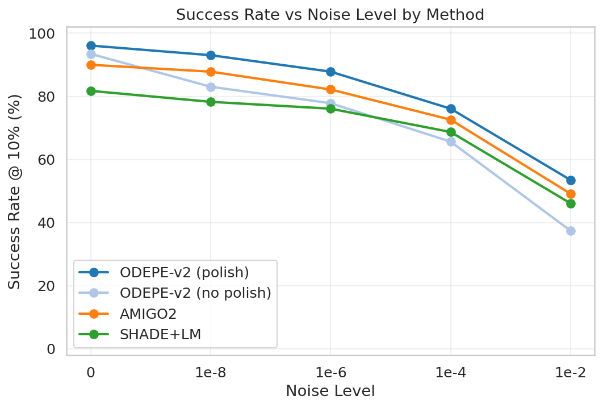

*Figure F01: Success rate at 10% threshold across noise levels.*

| Method | Success@1% | Success@10% | Success@50% | Median Time (s) | No Result | Diverged |
|--------|-----------|------------|------------|-----------------|-----------|----------|
| ODEPE-v2 (polish) | 71.9% | 81.3% | 86.3% | 854 | 6 | 0 |
| ODEPE-v2 (no polish) | 61.2% | 71.5% | 80.3% | 699 | 6 | 4 |
| AMIGO2 | 67.3% | 76.3% | 81.0% | 686 | 0 | 0 |
| SHADE+LM | 62.3% | 70.2% | 74.3% | 364 | 0 | 0 |

### Method Rankings

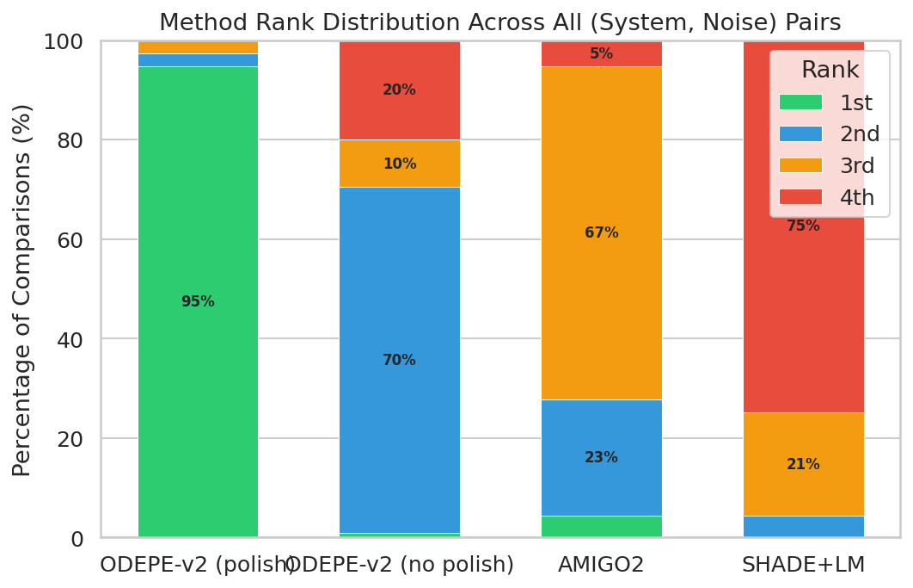

---

## 3. Noise Degradation Analysis

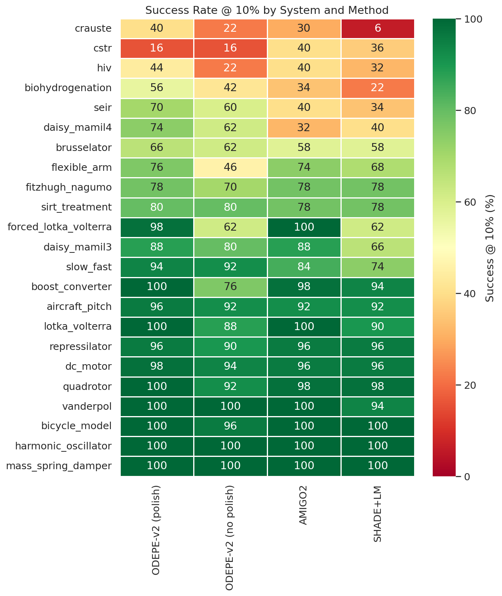

- At **noise=0**, the best methods achieve high success rates.
- The steepest degradation typically occurs between **noise=1e-4 and 1e-2**.

### Noise Cliffs

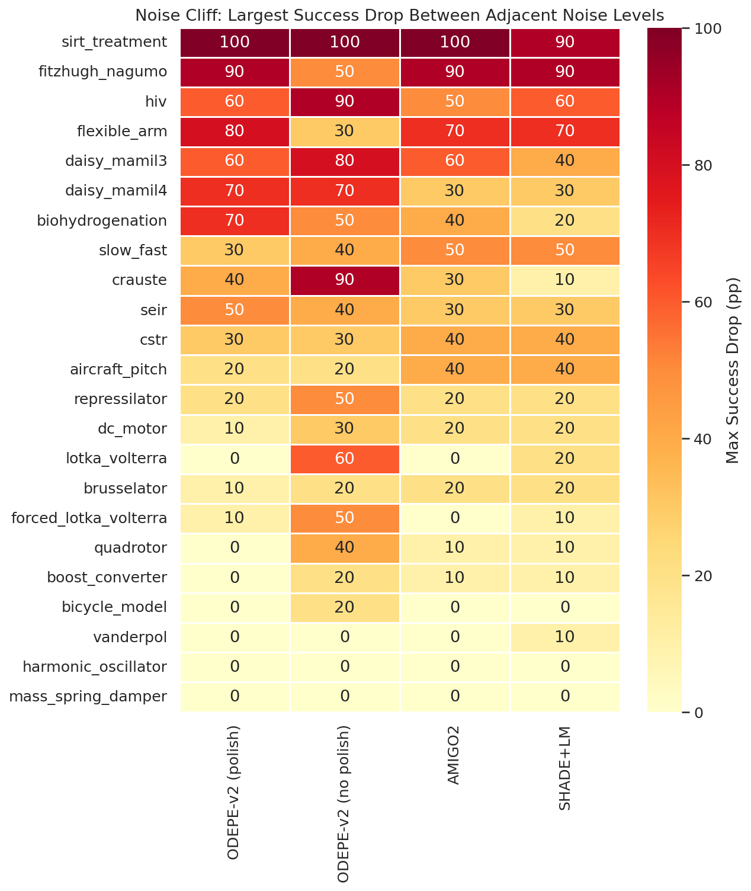

---

## 4. Polishing Effect

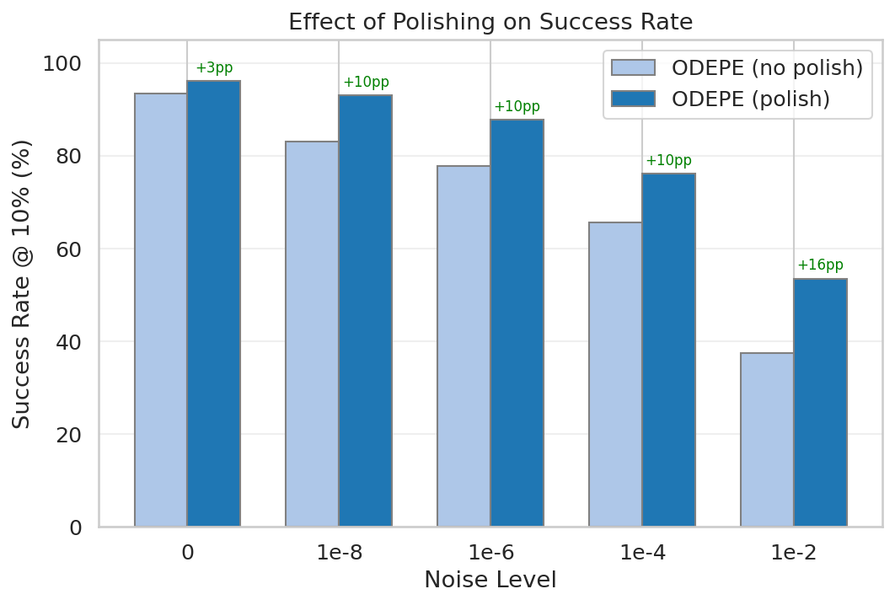

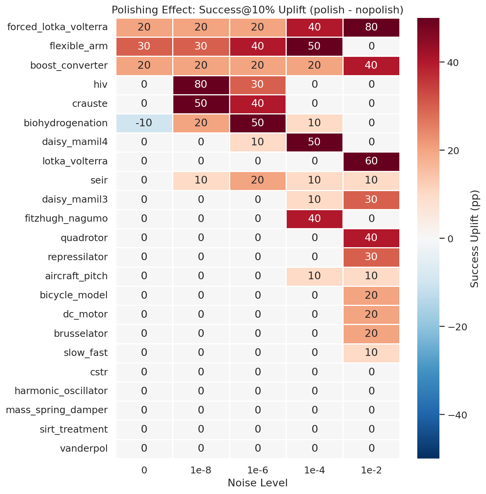

- Overall polishing uplift: **+9.8 percentage points**.
- Polishing adds a median of **nan seconds** overhead.
- Of 115 (system, noise) pairs: polishing **helped** in 39, **hurt** in 1, and was **neutral** in 75.

---

## 5. System Difficulty

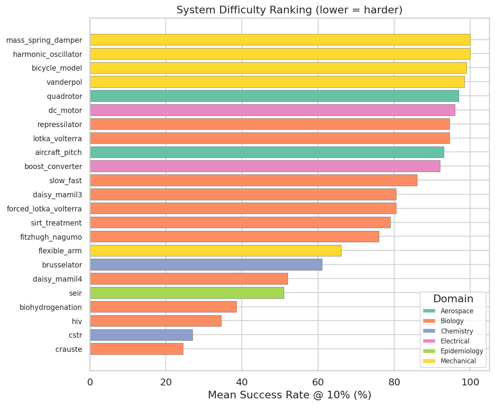

- **Hardest system:** `crauste` (24.5% mean success)
- **Easiest system:** `mass_spring_damper` (100.0% mean success)

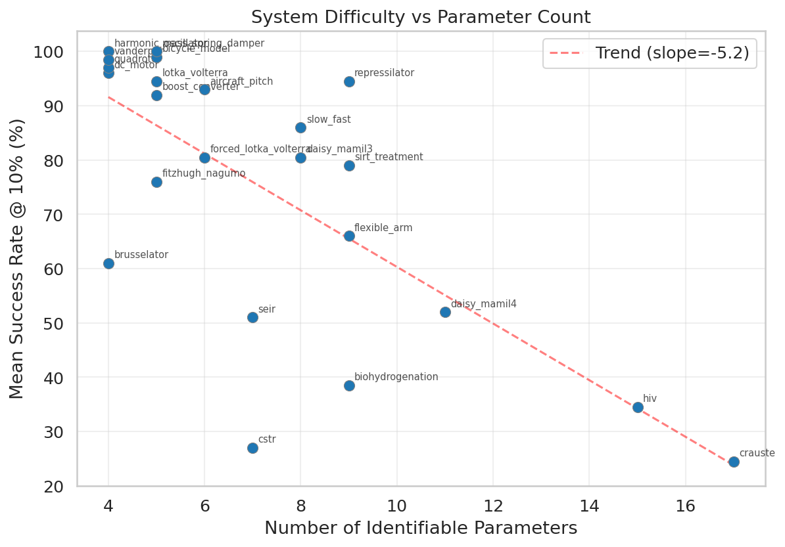

---

## 6. Domain Analysis

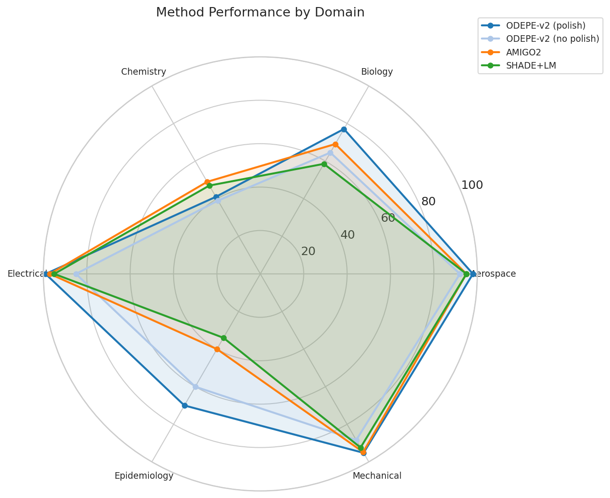

---

## 7. Replica Stability

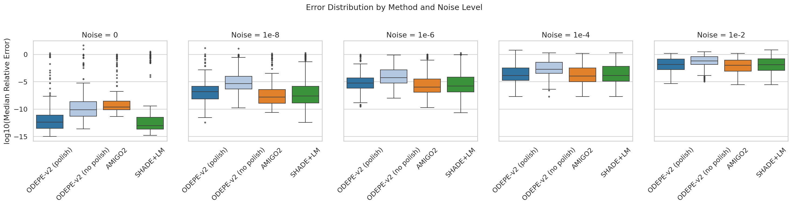

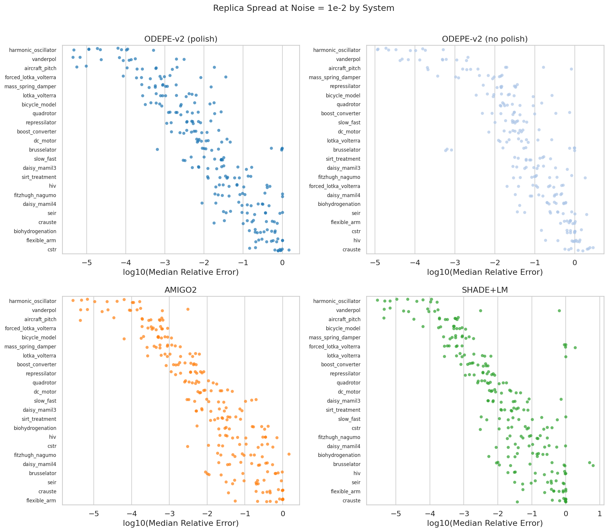

---

## 8. Failure Analysis

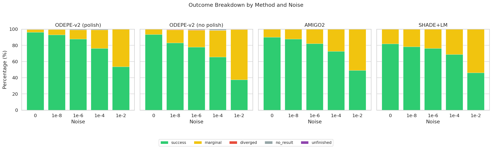

---

## 9. Timing and Speed-Accuracy Trade-off

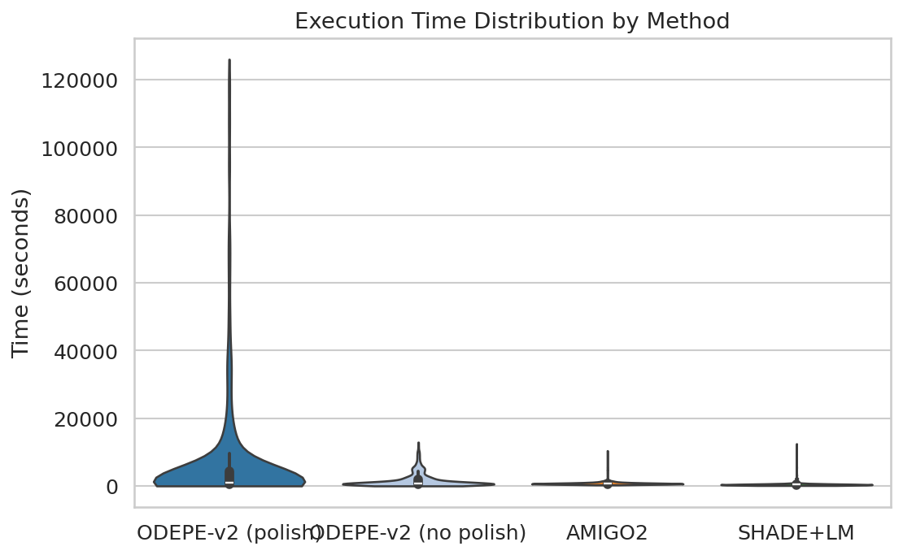

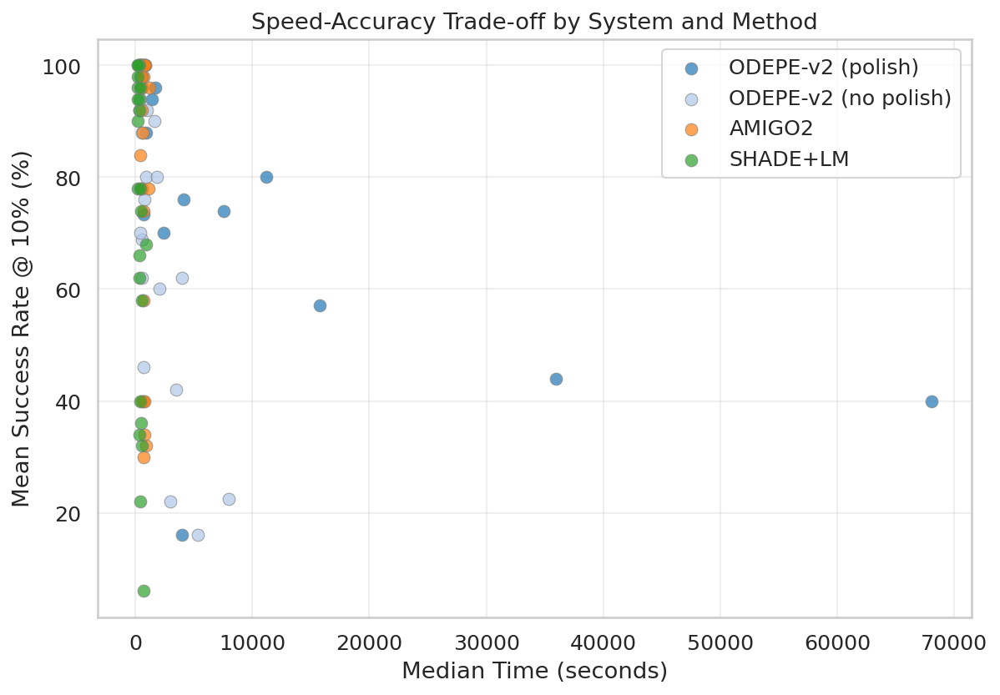

---

## 10. Conclusions

### Method Rankings (data-driven)
1. **ODEPE-v2 (polish)** -- 81.3% success@10%, median 854s
2. **AMIGO2** -- 76.3% success@10%, median 686s
3. **ODEPE-v2 (no polish)** -- 71.5% success@10%, median 699s
4. **SHADE+LM** -- 70.2% success@10%, median 364s

### Key Takeaways
- **Noise is the primary difficulty driver** -- success drops by ~44 pp from noise=0 to noise=1e-2.
- **Polishing is almost always worthwhile** -- it helps in 39/115 cases with modest time overhead.
- **No method dominates everywhere** -- ODEPE-v2 (polish) wins most often but specific systems favor other methods.
