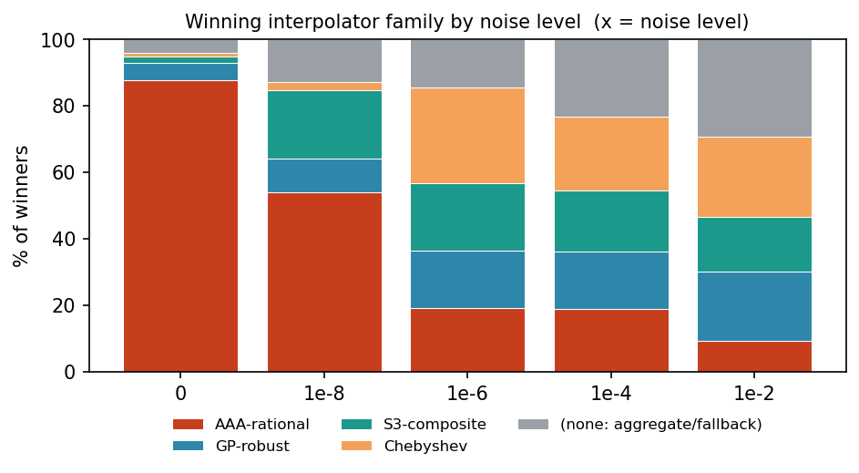
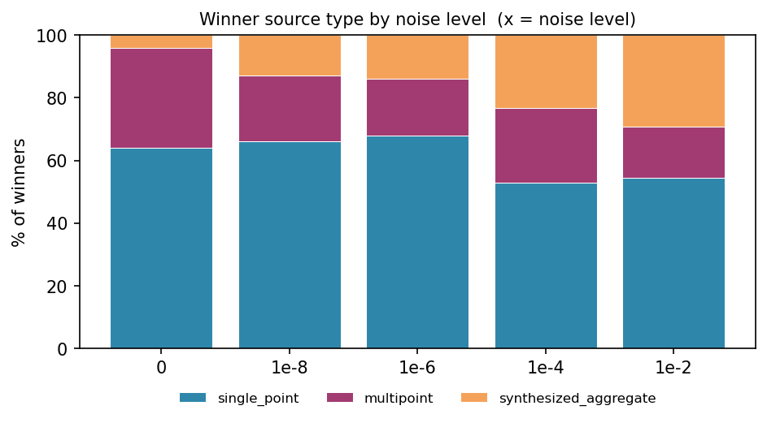
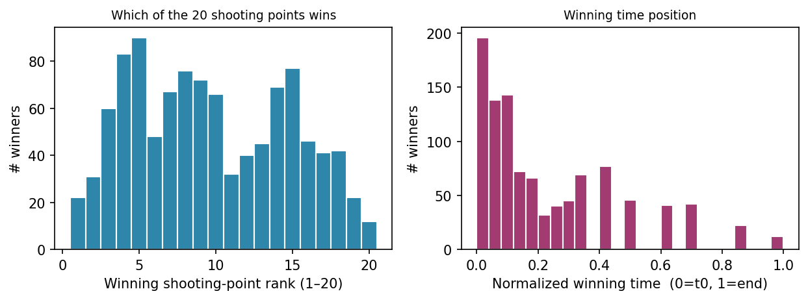
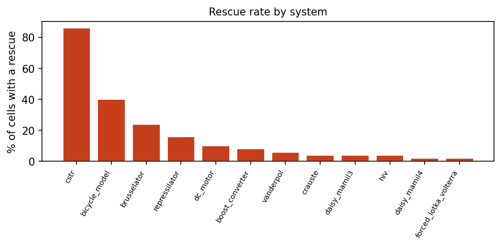
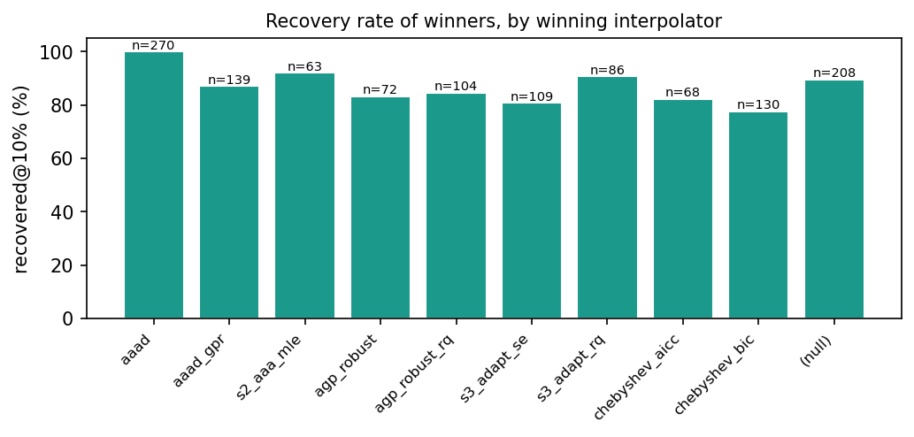

# Polish-arm winner provenance — final_v2 benchmark

_Where did each winning polish solution actually come from? Generated from `winner_provenance.csv` (extract_winner_provenance.py) over `benchmark_final_v2_2026-06-12/filetree/odepe_v2_polish_run/`._

### Scope & caveats (bound every number below)
1. **Winners only.** One observation per cell — `metadata["best"]`, the single returned solution. This says which interpolator / timepoint / path **won**, *not* the make-up of the full candidate pool. The pool and the selection/return mechanism are the **next exercise**.
2. **Provenance source.** 844 cells from `odepe_metadata.json["best"]`; 405 recovered by exact-matching the `result.csv` winner into `pool.csv` (those cells have a 0-byte metadata file — dropping them would have deleted whole systems and biased recovery up ~14 pts at high noise); 1 cell has no `result.csv` at all. The pool-recovered rows carry the same core provenance columns; a few metadata-only fields (practical-identifiability, raw/best counts) are blank for them.
3. **`(null)` interpolator is a real category** — the winner was a *synthesized aggregate* (no single interpolator) or a fallback, not missing data.
4. **Timepoints are exp-warped toward t0 by design** (`compute_shooting_indices`, β=3): the 20 shooting points cluster early, so *some* early-t bias is built in, not chosen. We report both the shooting-point rank (1–20) and the normalized time position.
5. **AAA-family is auto-filtered at high noise** (`auto_filter_interpolators`), so its disappearance as noise grows is expected behaviour, not failure.

## §0 — Overall summary

- **1250 cells** (25 systems × 5 noise × 10 reps), all `status=ok`.
- **Recovery (top-1):** 88.6% within 10% worst-param error, 79.7% within 1% — by noise (10%): 0=100%, 1e-8=98%, 1e-6=94%, 1e-4=86%, 1e-2=65%. (Matches the paper's polish SR-10, confirming the right cells/scoring.)
- **Winner kind:** single_point 61%, multipoint 22%, synthesized_aggregate 17%.
- **Rescue fired** on 8.3% of cells; terminal direct-opt fallback **never** produced a winner.

Winner kind by noise (% of cells):

| winner_kind | 0 | 1e-8 | 1e-6 | 1e-4 | 1e-2 | overall |
|---|---:|---:|---:|---:|---:|---:|
| single_point | 64.0 | 66.0 | 67.9 | 52.8 | 54.4 | 61.0 |
| multipoint | 32.0 | 21.2 | 18.1 | 24.0 | 16.4 | 22.3 |
| synthesized_aggregate | 4.0 | 12.8 | 14.1 | 23.2 | 29.2 | 16.7 |
| **n cells** | 250 | 250 | 249 | 250 | 250 | 1249 |

## §1 — Which interpolators won?

Every one of the 9 configured interpolators wins on some cells. `(null)` = the winner was a synthesized aggregate (no single interpolator).

| interpolator_source | n | % | recovered@10% |
|---|---:|---:|---:|
| aaad | 270 | 21.6 | 100.0 |
| aaad_gpr | 139 | 11.1 | 87.1 |
| s2_aaa_mle | 63 | 5.0 | 92.1 |
| agp_robust | 72 | 5.8 | 83.3 |
| agp_robust_rq | 104 | 8.3 | 84.6 |
| s3_adapt_se | 109 | 8.7 | 80.7 |
| s3_adapt_rq | 86 | 6.9 | 90.7 |
| chebyshev_aicc | 68 | 5.4 | 82.4 |
| chebyshev_bic | 130 | 10.4 | 77.7 |
| (null) | 208 | 16.7 | 89.4 |

**By family × noise** (the auto-filter story — AAA-rational dominates at low noise and is filtered out as noise rises; GP/S3/Chebyshev and aggregates take over):

| interpolator_family | 0 | 1e-8 | 1e-6 | 1e-4 | 1e-2 | overall |
|---|---:|---:|---:|---:|---:|---:|
| AAA-rational | 87.6 | 54.0 | 19.3 | 18.8 | 9.2 | 37.8 |
| GP-robust | 5.2 | 10.0 | 17.3 | 17.2 | 20.8 | 14.1 |
| S3-composite | 2.0 | 20.8 | 20.5 | 18.4 | 16.4 | 15.6 |
| Chebyshev | 1.2 | 2.4 | 28.9 | 22.4 | 24.4 | 15.9 |
| (none: aggregate/fallback) | 4.0 | 12.8 | 14.1 | 23.2 | 29.2 | 16.7 |
| **n cells** | 250 | 250 | 249 | 250 | 250 | 1249 |

**Interpolator family by system** (share of winners; AAA-rational vs the GP/spectral families):

| system | AAA | GP | S3 | Chebyshev | (none: |
|---|---:|---:|---:|---:|---:|
| aircraft_pitch | 44 | 4 | 12 | 24 | 16 |
| bicycle_model | 40 | 8 | 18 | 4 | 30 |
| biohydrogenation | 30 | 18 | 10 | 30 | 12 |
| boost_converter | 46 | 16 | 6 | 2 | 30 |
| brusselator | 32 | 18 | 20 | 8 | 22 |
| crauste | 48 | 12 | 14 | 16 | 10 |
| cstr | 18 | 18 | 40 | 22 | 2 |
| daisy_mamil3 | 38 | 4 | 16 | 26 | 16 |
| daisy_mamil4 | 43 | 4 | 6 | 14 | 33 |
| dc_motor | 36 | 12 | 14 | 20 | 18 |
| fitzhugh_nagumo | 42 | 30 | 6 | 16 | 6 |
| flexible_arm | 32 | 18 | 20 | 14 | 16 |
| forced_lotka_volterra | 18 | 12 | 22 | 8 | 40 |
| harmonic_oscillator | 44 | 20 | 6 | 18 | 12 |
| hiv | 30 | 26 | 20 | 18 | 6 |
| latent_subpopulation | 36 | 12 | 6 | 14 | 32 |
| lotka_volterra | 48 | 18 | 26 | 4 | 4 |
| mass_spring_damper | 36 | 10 | 10 | 24 | 20 |
| quadrotor | 38 | 18 | 10 | 14 | 20 |
| receptor_binding | 38 | 6 | 14 | 26 | 16 |
| repressilator | 46 | 10 | 18 | 26 | 0 |
| seir | 38 | 20 | 14 | 18 | 10 |
| sirt_treatment | 40 | 18 | 18 | 20 | 4 |
| slow_fast | 34 | 14 | 22 | 8 | 22 |
| vanderpol | 50 | 6 | 22 | 2 | 20 |

## §2 — Single-point vs multipoint vs synthesized aggregate

| source_type | 0 | 1e-8 | 1e-6 | 1e-4 | 1e-2 | overall |
|---|---:|---:|---:|---:|---:|---:|
| single_point | 64.0 | 66.0 | 67.9 | 52.8 | 54.4 | 61.0 |
| multipoint | 32.0 | 21.2 | 18.1 | 24.0 | 16.4 | 22.3 |
| synthesized_aggregate | 4.0 | 12.8 | 14.1 | 23.2 | 29.2 | 16.7 |
| **n cells** | 250 | 250 | 249 | 250 | 250 | 1249 |

**Synthesized aggregates win 16.7% of cells** (and rise sharply with noise — the solver increasingly returns a robust median/trimmed-mean over candidates rather than a single solve). Aggregation strategy when an aggregate wins:

| aggregation_strategy | n | % | recovered@10% |
|---|---:|---:|---:|
| median | 148 | 71.2 | 89.2 |
| trim25_mean | 56 | 26.9 | 92.9 |
| mean | 4 | 1.9 | 50.0 |

**Multipoint** winners use 2.0 timepoints on average (median 2).

## §3 — Which timepoints win? (single-point + multipoint winners)

Of the 1041 winners with a single source timepoint, the winning **shooting-point rank** (1=earliest of the 20 warped points … 20=last) and **normalized time** distribute as below. Recall the 20 points themselves cluster near t0, so rank is roughly uniform in point-index while normalized time is compressed toward 0.

| tpos | 0 | 1e-8 | 1e-6 | 1e-4 | 1e-2 | overall |
|---|---:|---:|---:|---:|---:|---:|
| t0 (≤0.02) | 5.8 | 5.5 | 1.9 | 5.2 | 7.3 | 5.1 |
| early (0.02–0.25) | 66.7 | 61.9 | 59.8 | 62.0 | 52.0 | 60.9 |
| mid (0.25–0.75) | 25.8 | 30.7 | 35.0 | 27.6 | 35.6 | 30.7 |
| late (0.75–0.98) | 1.2 | 1.4 | 2.8 | 3.6 | 1.7 | 2.1 |
| end (≥0.98) | 0.4 | 0.5 | 0.5 | 1.6 | 3.4 | 1.2 |
| **n cells** | 240 | 218 | 214 | 192 | 177 | 1041 |

Median normalized winning position by noise: 0=0.13, 1e-8=0.13, 1e-6=0.17, 1e-4=0.13, 1e-2=0.17.

## §4 — Rescue / fallback usage

`rescue_path` records an emergency re-solve after the primary algebraic solve produced blown candidates. `algebraic_resolve_t0` = re-solve the fixed-param system at t0; `direct_opt_fallback` = terminal numeric rescue.

| rescue_path | 0 | 1e-8 | 1e-6 | 1e-4 | 1e-2 | overall |
|---|---:|---:|---:|---:|---:|---:|
| none | 95.6 | 93.2 | 91.2 | 90.8 | 88.0 | 91.8 |
| algebraic_resolve_t0 | 4.4 | 6.8 | 8.8 | 9.2 | 12.0 | 8.2 |
| **n cells** | 250 | 250 | 249 | 250 | 250 | 1249 |

**Any rescue fired on 8.2% of cells.** It concentrates on a few systems (count of rescued cells, of 50 each):

| system | rescued cells | recovered@10% |
|---|---:|---:|
| cstr | 43 | 51% |
| bicycle_model | 20 | 100% |
| brusselator | 12 | 92% |
| repressilator | 8 | 88% |
| dc_motor | 5 | 100% |
| boost_converter | 4 | 75% |
| vanderpol | 3 | 100% |
| crauste | 2 | 0% |
| daisy_mamil3 | 2 | 0% |
| hiv | 2 | 0% |
| daisy_mamil4 | 1 | 100% |
| forced_lotka_volterra | 1 | 100% |

**Did rescued cells still recover?** rescued 70.9% vs 88.6% overall — rescue flags a hard cell.

## §5 — Candidate funnel, identifiability, and cost

`raw_count` (algebraic candidates generated) → `best_count` (size of the best-error class), metadata cells only (n=844):

| stat | raw_count | best_count |
|---|---:|---:|
| median | 396 | 1 |
| mean | 448 | 1 |
| p90 | 712 | 1 |
| max | 1509 | 1 |

**practical_identifiability_status** (metadata cells):

| practical_identifiability_status | n | % | recovered@10% |
|---|---:|---:|---:|
| advisory_available | 702 | 83.2 | 95.4 |
| not_assessed | 142 | 16.8 | 93.7 |

**Wall-clock cost** (median seconds / cell) by noise: 0=695s, 1e-8=721s, 1e-6=693s, 1e-4=537s, 1e-2=666s. Most expensive systems (median s): crauste 21748, cstr 9923, repressilator 2265, hiv 1315, flexible_arm 1275.

---
_Winners-only report. Next: the full candidate pool + why a given candidate is returned._
