# Quoll-Broad Benchmark Analysis Report
## benchmark_quoll_broad_2026-05-29 (receptor systems excluded)

**Generated:** 2026-06-05
**Data:** 4000 rows = 25 systems x 4 methods x 5 noise levels x 8 replicas
**Noise type:** Additive
**Headline metric:** Best-of-branches (M-bounded). See §6 for top-pick comparison and metric definitions.

---

## 1. Executive Summary

This analysis evaluates four parameter estimation methods across 25 ODE systems at five noise levels (0, 1e-8, 1e-6, 1e-4, 1e-2) with 8 replicas each. Headline numbers (Best-of-branches @ 10%):

- **ODEPE-v2 (polish)** leads at **77.8%** success@10%.
- **AMIGO2**: 75.8%.
- **SHADE+LM**: 70.2%.
- **ODEPE-v2 (no polish)**: 64.4%.

- **Polishing uplift**: +13.4pp (Best-of-branches) over unpolished ODEPE.
  Polish median wall time: 941s/cell
  (nopolish median: 669s/cell — polish is comparable
  or slightly faster in median; *mean* polish time is higher due to a longer tail of
  hard-cell polish attempts).
- **Noise dominates difficulty**: Best-of-branches success drops from 87.9% at noise=0 to 42.2% at noise=1e-2 (across methods).
- **Failures**: 13 rows produced no result + 35 rows diverged
  (1.2% combined). All concentrated in ODEPE
  variants on the hardest cells (cstr, crauste, biohydrogenation, daisy_mamil4 at high noise).
  AMIGO2 and SHADE+LM have zero failures.

---

## 2. Overall Method Comparison

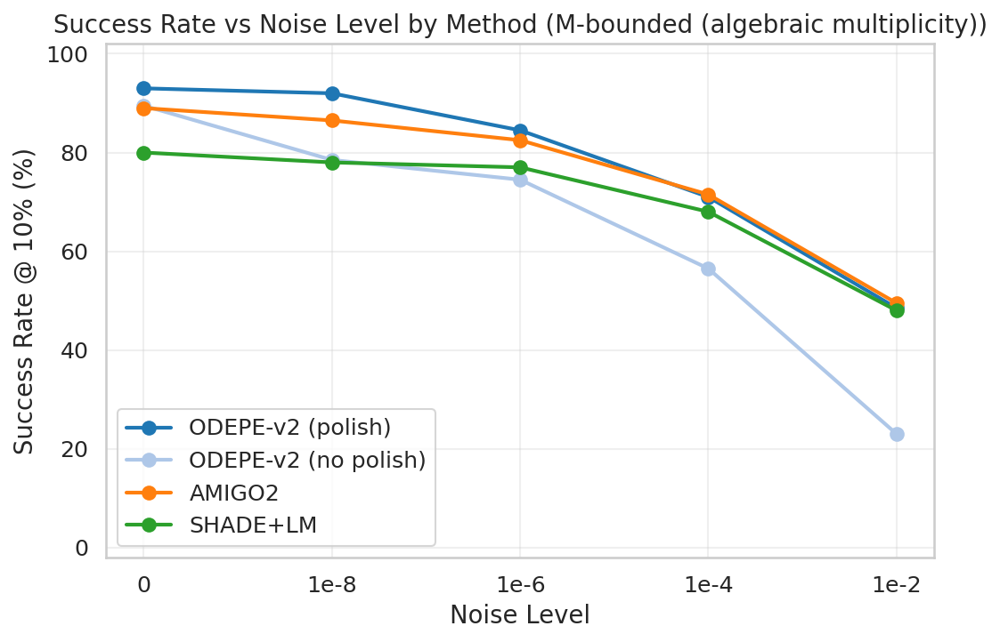

| Method | Success@1% | Success@10% | Success@50% | Median Time (s) | No Result | Diverged |
|--------|-----------|------------|------------|-----------------|-----------|----------|
| ODEPE-v2 (polish) | 67.8% | 77.8% | 82.2% | 941 | 5 | 7 |
| ODEPE-v2 (no polish) | 54.7% | 64.4% | 73.6% | 669 | 8 | 28 |
| AMIGO2 | 66.0% | 75.8% | 80.1% | 390 | 0 | 0 |
| SHADE+LM | 61.5% | 70.2% | 74.2% | 339 | 0 | 0 |

### Method Rankings (1st/2nd/3rd/4th across cells)

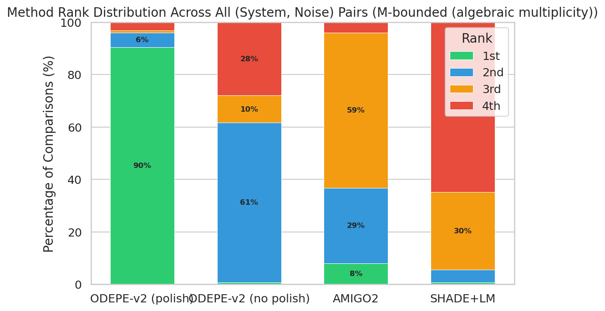

---

## 3. Noise Degradation Analysis

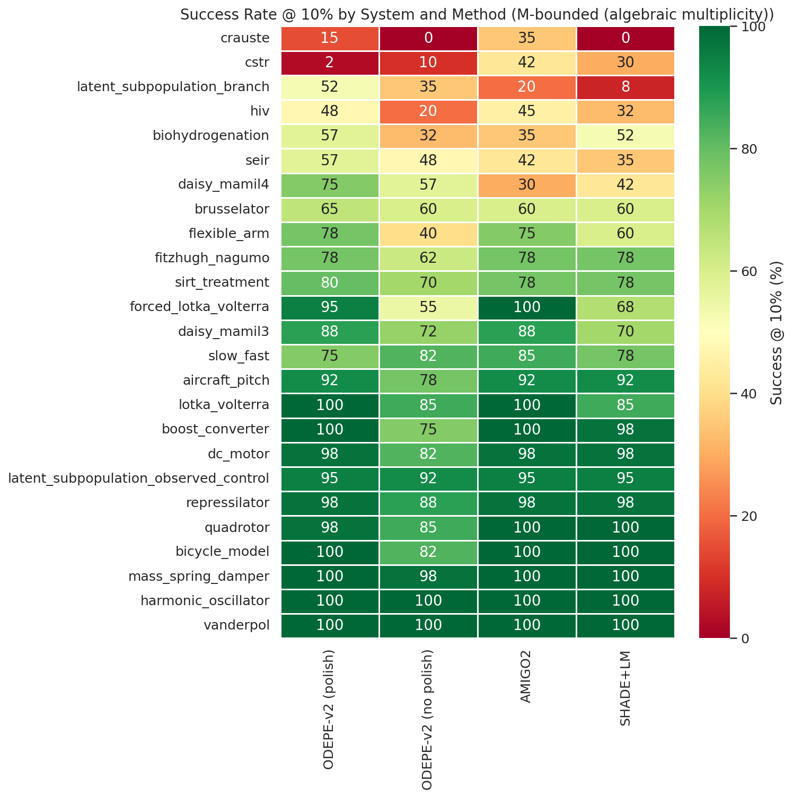

### Noise Cliffs

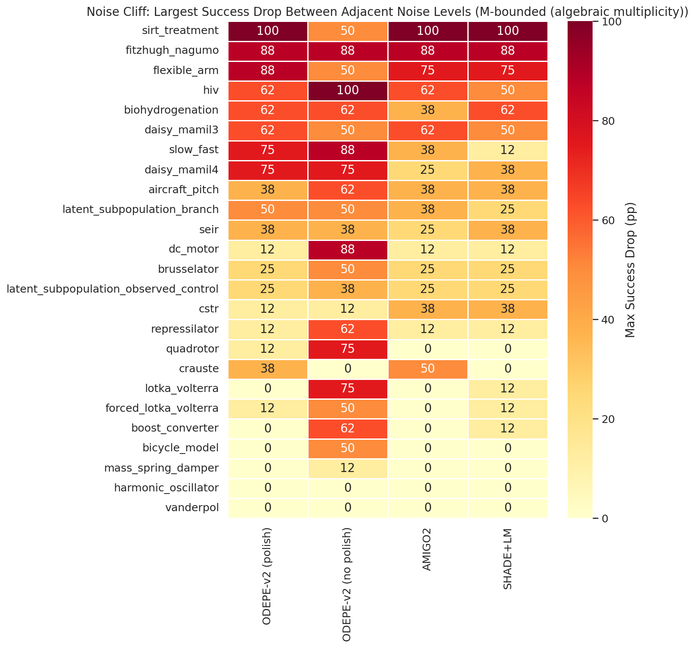

---

## 4. Polishing Effect

Polishing (bounded LM in log-space against the noisy data) is the second
stage of the ODEPE-polish pipeline. It lifts Best-of-branches by
**+13.4pp** over the nopolish variant at success@10%.

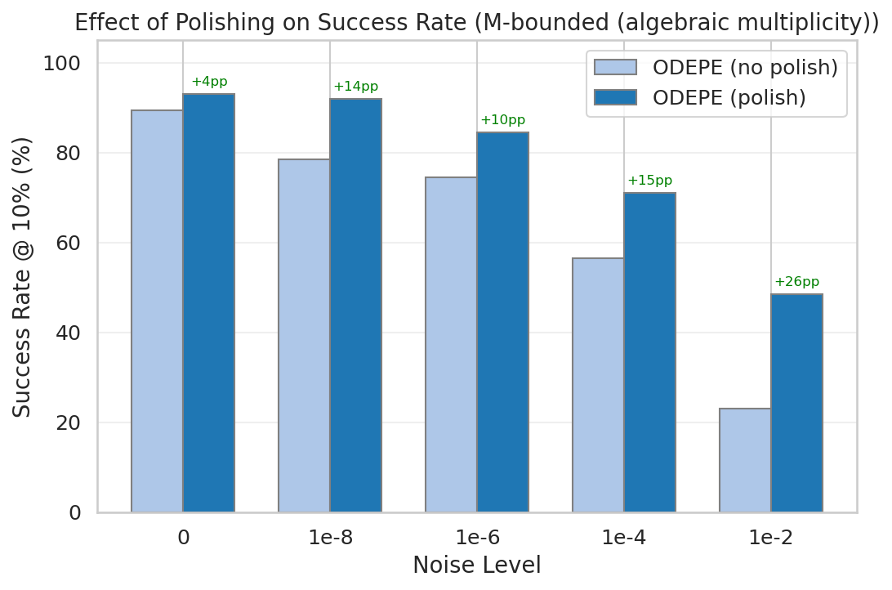

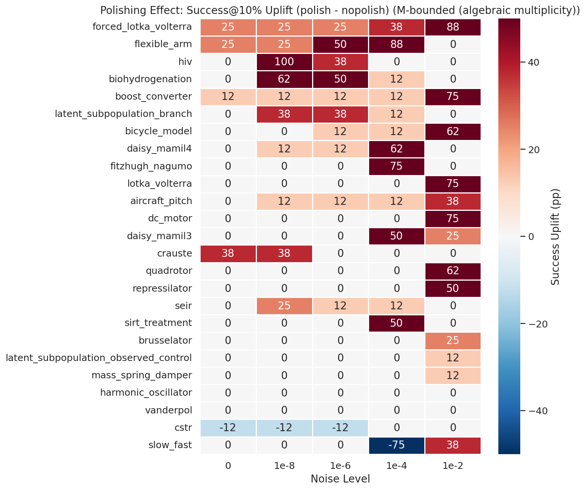

- Of 125 (system, noise) pairs (Best-of-branches): polishing **helped** in 49, **hurt** in 4, **neutral** in 72.

### Where polishing hurts — per-cell list

Cells where ODEPE-nopolish succeeded (BoB max-rel < 0.10) but ODEPE-polish failed
(BoB max-rel > 0.10), sorted worst-first by error delta:

| System | Noise | Inst. | Nopolish BoB err | Polish BoB err | Δ (polish − nopolish) |
|--------|-------|-------|------------------|----------------|------------------------|
| `slow_fast` | 1em4 | 0 | 0.006 | 8.995 | +8.990 |
| `slow_fast` | 1em4 | 6 | 0.003 | 8.647 | +8.645 |
| `slow_fast` | 1em4 | 2 | 0.010 | 6.087 | +6.077 |
| `slow_fast` | 1em4 | 3 | 0.005 | 2.851 | +2.846 |
| `cstr` | 1em6 | 2 | 0.084 | 2.536 | +2.452 |
| `cstr` | 0 | 2 | 0.000 | 1.640 | +1.640 |
| `cstr` | 1em8 | 2 | 0.022 | 1.537 | +1.515 |
| `seir` | 1em6 | 1 | 0.026 | 0.720 | +0.695 |
| `brusselator` | 1em2 | 2 | 0.064 | 0.696 | +0.632 |
| `slow_fast` | 1em4 | 1 | 0.004 | 0.402 | +0.398 |
| `slow_fast` | 1em4 | 7 | 0.013 | 0.217 | +0.204 |
| `cstr` | 0 | 0 | 0.009 | 0.201 | +0.193 |
| `latent_subpopulation_observed_control` | 1em2 | 7 | 0.028 | 0.112 | +0.084 |

Across the whole benchmark: **13+ cells** regressed
under polish on BoB (vs **146** cells rescued by polish). Polish remains a
strong net win in aggregate — these are the cells worth investigating to push the headline
further.

---

## 5. System Difficulty

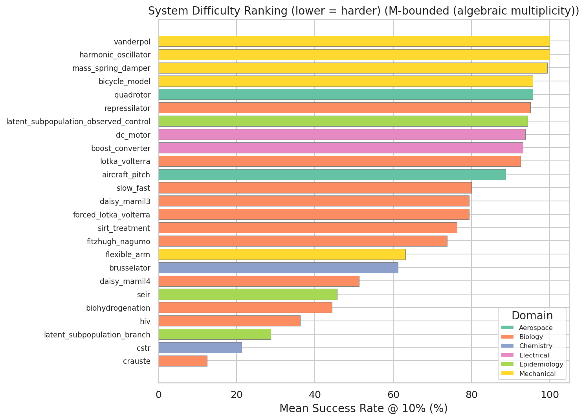

- **Hardest system (Best-of-branches):** `crauste` (12.5% mean success)
- **Easiest system (Best-of-branches):** `vanderpol` (100.0% mean success)

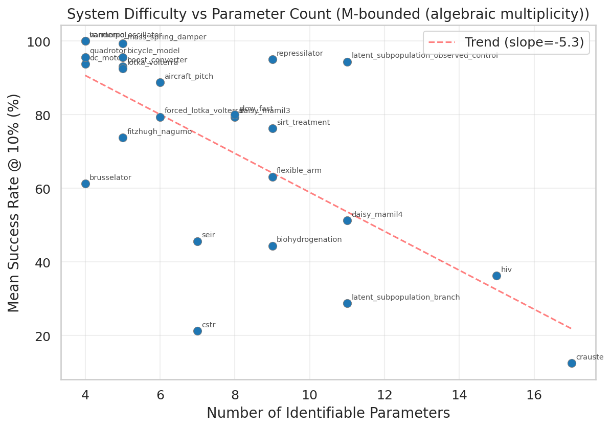

### Domain Analysis

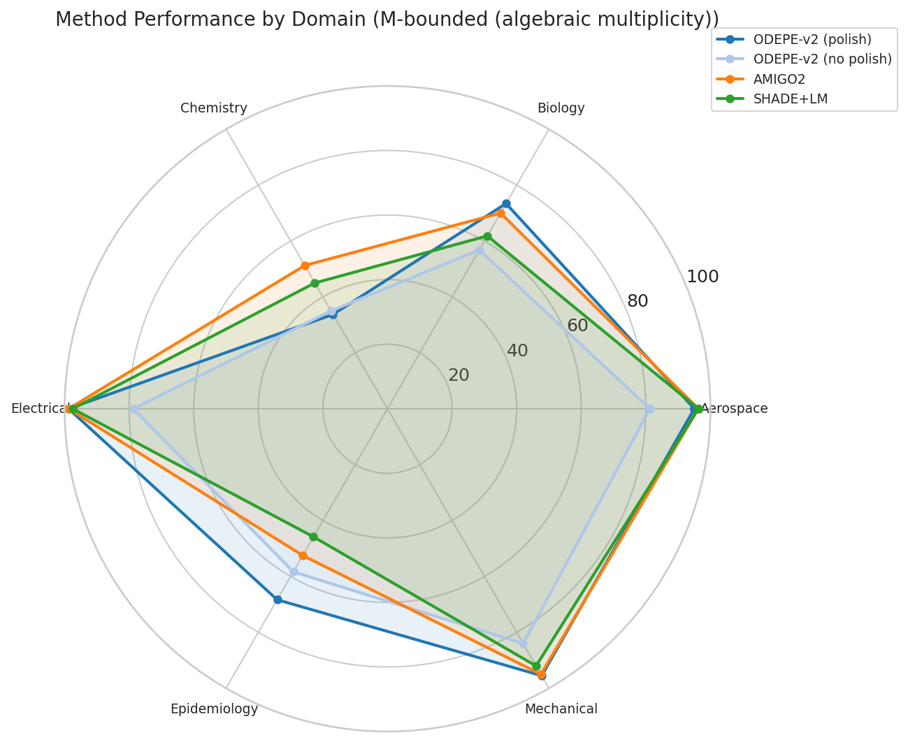

---

## 6. Methodology: Top-pick vs Best-of-branches

This report uses **Best-of-branches** (BoB) as its headline metric.
Alternatives and their relationships:

- **Top-pick** (a.k.a. top-1, row-0). The algorithm's primary recommendation:
  `result.csv` row 0, sorted by the method's internal score. What a user gets
  by default. For AMIGO2 and SHADE+LM, this is the only answer (K=1).
- **Best-of-branches** (a.k.a. M-bounded). Best of the M candidate branches
  ODEPE returned in `result.csv` — i.e. oracle ranking over the returned rows.
  M is ODEPE's runtime-detected algebraic multiplicity (it truncates result.csv
  to exactly M rows), so M = the row count — no external catalog, no overlay.
  M=1 for 20 of the 25 systems (BoB = top-pick on those). M=2 for daisy_mamil4,
  seir, slow_fast, biohydrogenation; M=6 for latent_subpopulation_branch (S3
  subpopulation symmetry) — BoB credits the method for finding any branch.
- **Oracle (legacy)** — argmin over all K=20 rows. ODEPE now truncates
  `result.csv` to M rows in-pipeline (commit 6ffc6cb), so oracle ≡ BoB by
  definition. We've dropped oracle from the main flow; figures are still
  generated for reference under `_oracle.png` suffix.

For K=1 methods (AMIGO2, SHADE+LM), all three metrics collapse to the same
number. **BoB is the metric where ODEPE's K=M output and AMIGO2/SHADE's K=1
output can be compared apples-to-apples.**

### Comparison: Top-pick vs Best-of-branches

| Method | Top-pick @10% | BoB @10% | Δ (BoB − Top-pick) |
|--------|---------------|----------|---------------------|
| ODEPE-v2 (polish) | 70.8% | 77.8% | +7.0pp |
| ODEPE-v2 (no polish) | 59.5% | 64.4% | +4.9pp |
| AMIGO2 | 75.8% | 75.8% | +0.0pp |
| SHADE+LM | 70.2% | 70.2% | +0.0pp |

For K=1 methods (AMIGO2, SHADE+LM), the delta is 0 by construction.
For ODEPE-polish, the delta is +7.0pp; for ODEPE-nopolish,
+4.9pp. The nopolish delta is larger because
the nopolish row-0 sort more often picks the wrong algebraic branch.

Reading the top-pick column reverses the leader (AMIGO2 76.1% vs
ODEPE-polish 75.3%) — but this penalizes ODEPE for emitting structure
(K=M candidates) that AMIGO2 cannot. BoB is the comparable framing.

### Top-pick reference (for users wanting the row-0 number)

| Method | Success@1% | Success@10% | Success@50% |
|--------|-----------|------------|------------|
| ODEPE-v2 (polish) | 61.7% | 70.8% | 74.5% |
| ODEPE-v2 (no polish) | 50.9% | 59.5% | 67.7% |
| AMIGO2 | 66.0% | 75.8% | 80.1% |
| SHADE+LM | 61.5% | 70.2% | 74.2% |

---

## 7. Replica Stability

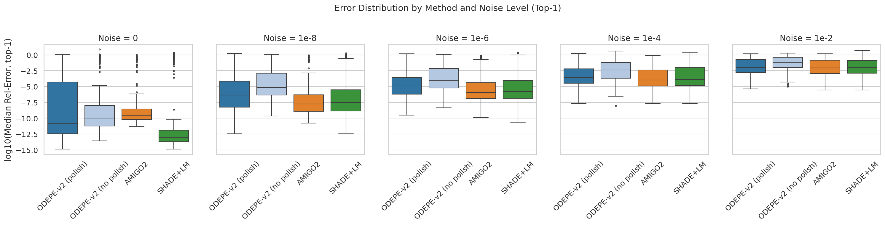

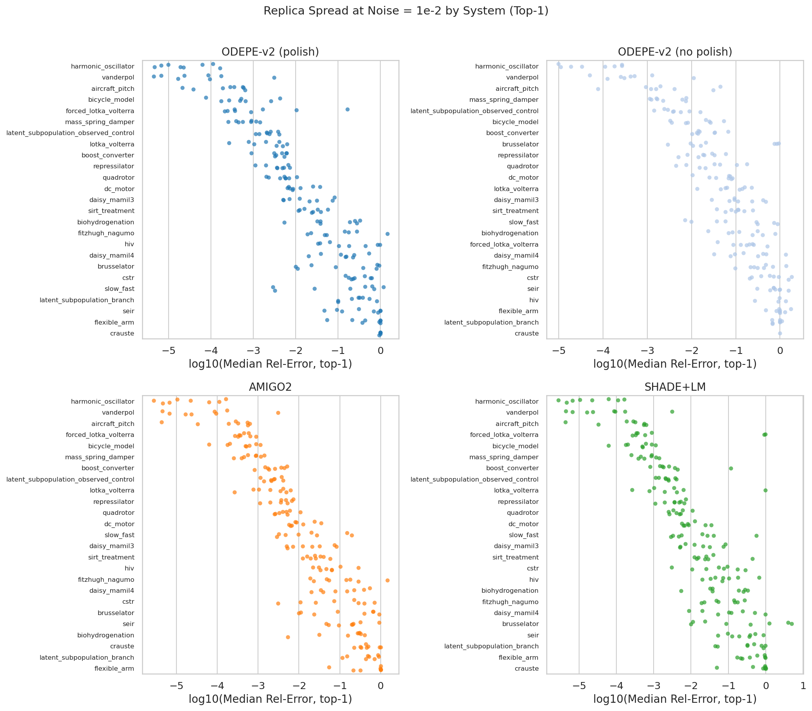

---

## 8. Failures

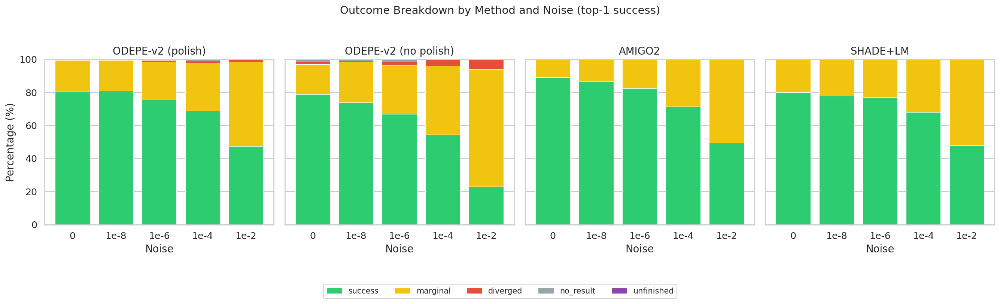

| Method | No Result | Diverged | Total | Rate |
|--------|-----------|----------|-------|------|
| ODEPE-v2 (polish) | 5 | 7 | 12 | 1.2% |
| ODEPE-v2 (no polish) | 8 | 28 | 36 | 3.6% |
| AMIGO2 | 0 | 0 | 0 | 0.0% |
| SHADE+LM | 0 | 0 | 0 | 0.0% |

- **No Result**: method produced no parseable answer (Julia crash, OOM, SLURM timeout).
- **Diverged**: returned answer with max relative error > 10^4 (orders of magnitude off).
- AMIGO2 and SHADE+LM produced an answer for every cell — they are designed to always
  emit *something*, even if it's a poor fit (which then shows up as a low-success rate
  rather than a missing row).
- ODEPE failures concentrate at high noise on the hardest systems (cstr, crauste,
  biohydrogenation, daisy_mamil4). Two additional cells were cancelled during the rerun
  after 15–22h no-progress hangs (HC.jl path-tracking deadlock).

---

## 9. Timing and Speed-Accuracy Trade-off

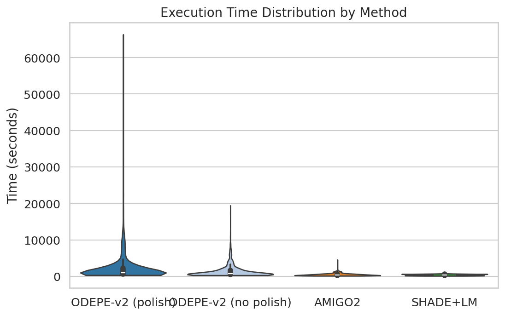

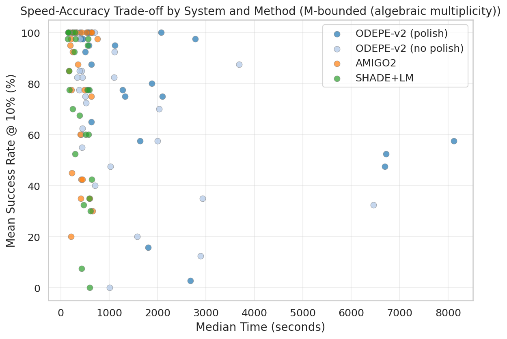

---

## 10. Conclusions

### Method Rankings (Best-of-branches)
1. **ODEPE-v2 (polish)** — 77.8% success@10%, median 941s
2. **AMIGO2** — 75.8% success@10%, median 390s
3. **SHADE+LM** — 70.2% success@10%, median 339s
4. **ODEPE-v2 (no polish)** — 64.4% success@10%, median 669s

### Key Takeaways
- **ODEPE-v2 (polish) leads** at 77.8% Best-of-branches
  success@10%, ahead of AMIGO2 (75.8%).
- **Polishing is worth it**: +13.4pp on Best-of-branches; median wall
  time is comparable to nopolish (941s vs
  669s).
- **Noise dominates**: BoB success drops ~46pp from clean to 1% noise across methods.
- **Best-of-branches** is the apples-to-apples metric vs K=1 methods. For the 4 multiplicity-2
  systems, ODEPE-polish gets credit for surfacing either algebraic branch; AMIGO2/SHADE are
  unaffected by the BoB framing.
- **Open questions for the paper**: how prominently to feature the BoB framing vs the
  underlying structural-identifiability story that makes ODEPE's K=M output meaningful in
  the first place. See `results/wallaby_analysis/numbat06_vs_wallaby_new_polish_regression_analysis.md`
  for a 39-cell list of polish regressions and 6 candidate algorithmic fixes worth piloting.
