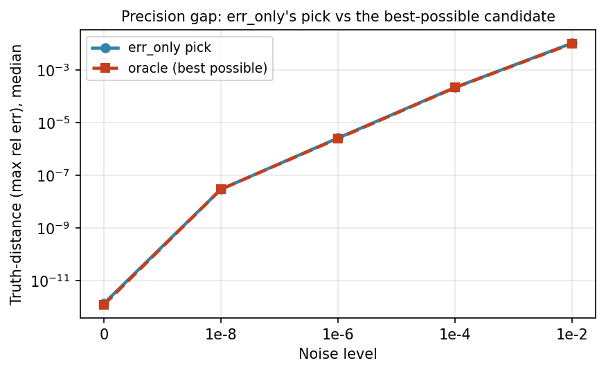
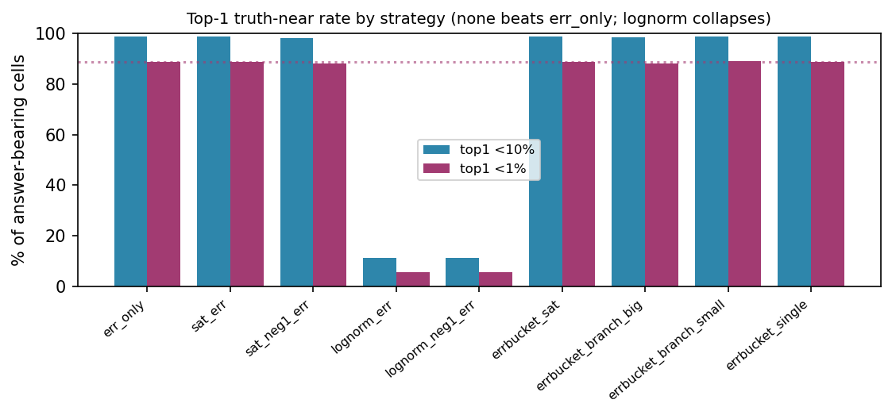
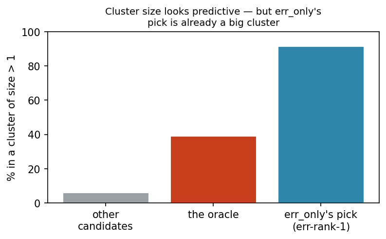
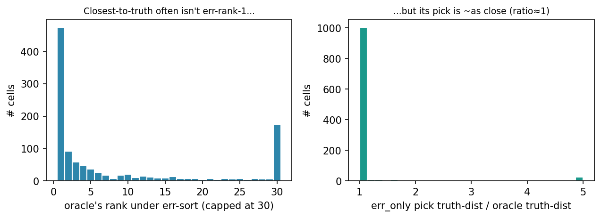

# Candidate-selection study — final_v2 polish arm

_Is the simple **err-only** selection rule leaving accuracy on the table, and do the old (reverted) strategies or pool features recover it? From `selection_per_cell.csv` (replay_strategies.py) over `odepe_v2_polish_run` (1250 cells). Ranking never sees truth; truth is used only to score the chosen candidate._

### Setup
- **Oracle** = the candidate with the smallest `max_rel_err` (truth-distance over identifiable vars). **Answer-bearing cell** = the pool contains a candidate within 10% of truth (90% of cells); selection can only help here, so all rates below are over answer-bearing cells. The non-answer-bearing 10% are a solver/derivative problem, out of selection's reach.
- We replay the **5 production `rank_strategy` schemes** (exact sort tuples) + 4 prototyped **err-bucketed** rerankers (err to half-order buckets, a feature breaks near-ties).

## §1 — Where does the closest-to-truth candidate rank under err alone, and what does that cost?

Sorting the pool by `err`, the **single closest-to-truth candidate is rank 1 only 42%** of the time (median rank 2, p90 48). So err is usually *not* a perfect proxy for truth-distance — the best candidate is often a few places down the err list.

**But the cost of that is tiny.** What err_only actually picks is essentially as close to truth as the best-possible candidate, at every noise level:

| noise | answer-bearing % | oracle@rank-1 % | oracle rank (med) | err_only pick | oracle (best) | err_only <1% |
|---|---:|---:|---:|---:|---:|---:|
| 0 | 100 | 66 | 1 | 1.29e-12 | 1.15e-12 | 100 |
| 1e-8 | 98 | 68 | 1 | 2.88e-08 | 2.88e-08 | 98 |
| 1e-6 | 94 | 44 | 2 | 2.59e-06 | 2.48e-06 | 97 |
| 1e-4 | 86 | 12 | 16 | 2.19e-04 | 2.14e-04 | 92 |
| 1e-2 | 70 | 7 | 31 | 1.06e-02 | 1.02e-02 | 46 |

The `err_only pick` and `oracle (best)` columns track within a few percent everywhere — **even a perfect, truth-aware selector would barely do better.** The oracle@rank-1 rate falls with noise (66%→7%) because near the top the candidates bunch up in truth-distance, so *which* one is microscopically closest becomes a coin flip that doesn't matter.

**Is `err` a good proxy for truth-distance?** Per-cell Spearman(`err`, `max_rel_err`) over each cell's low-err candidates, by noise (1.0 = err perfectly orders by truth-distance):

| noise | 0 | 1e-8 | 1e-6 | 1e-4 | 1e-2 |
|---|---:|---:|---:|---:|---:|
| median Spearman ρ | 0.91 | 0.63 | 0.67 | 0.60 | 0.12 |

ρ is high at low noise (err orders candidates well) and decays as noise rises — but, per the table above, even where err orders poorly its rank-1 pick is still ~as close to truth as the oracle, because the top candidates are all near-truth.

## §2 — Do the old strategies (or the prototypes) pick closer, and when?

Over all answer-bearing cells (the 5 production schemes, then the prototypes):

| strategy | top1 <1% | top1 <10% | median pick (truth-dist) | oracle @ rank-1 |
|---|---:|---:|---:|---:|
| err_only  ← current | 88.9 | 98.8 | 1.95e-06 | 42.3% |
| sat_err | 88.9 | 98.8 | 1.95e-06 | 42.3% |
| sat_neg1_err | 88.2 | 98.2 | 2.00e-06 | 42.0% |
| lognorm_err | 5.4 | 11.2 | 4.48e+00 | 0.1% |
| lognorm_neg1_err | 5.4 | 11.2 | 4.48e+00 | 0.1% |
| errbucket_sat | 88.9 | 98.8 | 1.95e-06 | 42.3% |
| errbucket_branch_big | 88.0 | 98.6 | 1.96e-06 | 40.9% |
| errbucket_branch_small | 89.0 | 98.8 | 2.29e-06 | 37.8% |
| errbucket_single | 88.9 | 98.9 | 2.04e-06 | 41.6% |

**No scheme beats `err_only`.** `sat_err`/`errbucket_sat` are *identical* — `saturation_count` is 0 for the low-err candidates (a saturated solution fits worse, so it already has higher err), so the saturation key never fires where it matters. `sat_neg1_err` (**legacy S2**) is slightly *worse*: its `is_untagged` key promotes the ~6% of candidates that happen to carry a `polish_source_hc_idx` above everything else — an artifact, not a quality signal — which is the mechanism behind the 2026-05-19 revert. `lognorm_*` is **catastrophic** (it sorts by parameter magnitude, ignoring fit). The err-bucketed prototypes tie err_only at best.

**By noise** (top1 <1%, the demanding threshold — does anything win at high noise?):

| strategy | 0 | 1e-8 | 1e-6 | 1e-4 | 1e-2 |
|---|---:|---:|---:|---:|---:|
| err_only | 99.6 | 98.4 | 97.0 | 92.1 | 46.0 |
| sat_err | 99.6 | 98.4 | 97.0 | 92.1 | 46.0 |
| sat_neg1_err | 98.8 | 97.6 | 96.2 | 91.2 | 46.0 |
| lognorm_err | 8.8 | 8.6 | 3.8 | 3.2 | 1.1 |
| lognorm_neg1_err | 8.8 | 8.6 | 3.8 | 3.2 | 1.1 |
| errbucket_sat | 99.6 | 98.4 | 97.0 | 92.1 | 46.0 |
| errbucket_branch_big | 99.6 | 98.4 | 97.0 | 91.2 | 41.5 |
| errbucket_branch_small | 99.6 | 98.4 | 97.0 | 92.1 | 46.6 |
| errbucket_single | 99.6 | 98.4 | 97.0 | 92.1 | 46.0 |

## §3 — Do cluster size / saturation / provenance help? And the absolute ceiling.

**The ceiling first.** The `oracle (best possible)` column in §1 is the result of a *perfect, truth-aware* selector — the most any reranker (hand-crafted or learned) could achieve. It improves median truth-distance over err_only by at most a few percent at every noise (e.g. 1.06e-02 → 1.02e-02 at 1e-2). So there is essentially **no headroom** for a smarter selector; the leftover error is set by the candidate *pool*, not the selection rule.

**Why no feature helps — the cluster-size case study.** The one feature that *looks* predictive is cluster size (`branch_size`): the oracle sits in a multi-candidate cluster **39%** of the time vs **6%** for other candidates. But err already rides this signal — the truth-closest solution attracts many converging candidates *and* fits the data, so **err_only's own pick (err-rank-1) is in a big cluster 91% of the time** (median `branch_size` 84). Selecting the largest-cluster candidate in the err-top-20 instead lands the oracle only **42%** of the time vs **53%** for plain err-rank-1 — cluster size is *redundant* with err, not additive.

The other features carry no usable signal among the low-err candidates:

| feature | oracle (median) | non-oracle (median) | discriminates the oracle? |
|---|---:|---:|---|
| saturation_count | 0.0 | 0.0 | no — ~0 for all low-err candidates |
| shooting index | 101.0 | 101.0 | no |
| # identifiable vars | 6.0 | 6.0 | no |

Provenance (`source_type`/`interpolator_source`) of the oracle mirrors the low-err pool too. Net: **nothing flags the truth-closest candidate that err hasn't already surfaced.**

## §4 — By system, and the recommendation

Hardest systems (largest err_only pick truth-distance) — the pick still tracks the oracle:

| system | cells | oracle@rank-1 | err_only pick | oracle (best) | err_only <1% |
|---|---:|---:|---:|---:|---:|
| cstr | 24 | 21% | 1.18e-04 | 1.18e-04 | 79 |
| crauste | 27 | 48% | 9.32e-05 | 9.32e-05 | 81 |
| hiv | 18 | 17% | 3.57e-05 | 4.06e-06 | 94 |
| fitzhugh_nagumo | 39 | 15% | 3.07e-05 | 3.07e-05 | 77 |
| biohydrogenation | 47 | 34% | 9.31e-06 | 9.31e-06 | 83 |
| receptor_binding | 49 | 33% | 8.27e-06 | 8.27e-06 | 82 |
| flexible_arm | 38 | 13% | 7.48e-06 | 7.48e-06 | 87 |
| sirt_treatment | 45 | 33% | 6.50e-06 | 6.50e-06 | 89 |
| dc_motor | 49 | 43% | 5.20e-06 | 5.20e-06 | 82 |
| seir | 48 | 29% | 5.07e-06 | 3.71e-06 | 85 |

### Recommendation
1. **Keep `err_only`.** On 1{,}250 polish cells it is *near-optimal at every noise level* — its pick is within a few percent of the best-possible candidate's truth-distance — and **no tested scheme or feature improves on it**. The 2026-06-12 revert is rigorously validated.
2. **The old strategies don't help and some hurt.** S2 (`sat_neg1_err`) is slightly worse via the `is_untagged` artifact; `lognorm` is catastrophic. Recommend formally retiring them (or at least flagging `is_untagged`-based keys as broken).
3. **The leftover precision is a *pool* problem, not a *selection* problem.** A perfect oracle selector buys almost nothing, so further accuracy must come from better candidates (derivative estimation / solver / polishing), not a smarter rule.

---
_Candidate-level replay (median `branch_size`=1, so ≈ the cluster-rep production path; `err_only` top-1 reproduces the result.csv winner 10/10 on spot-check; a Julia replay with the **real** ODEPE ranking functions on 105 pools confirms PRODUCTION (cluster+rank) = err_only = S2 at 98.8% top-1, so clustering is immaterial). Truth used only to score picks, never to rank._
