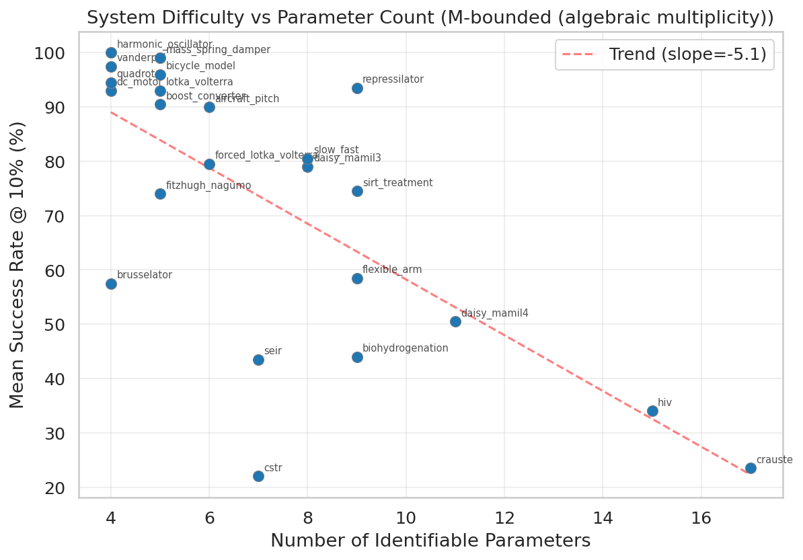

# Wallaby Benchmark Analysis Report
## benchmark_wallaby_2026-05-17 (M-truncated rerun, post-2026-05-21)

**Generated:** 2026-05-23
**Data:** 4600 rows = 23 systems x 4 methods x 5 noise levels x 10 replicas
**Noise type:** Additive
**Headline metric:** Best-of-branches (M-bounded). See §6 for top-pick comparison and metric definitions.

---

## 1. Executive Summary

This analysis evaluates four parameter estimation methods across 23 ODE systems at five noise levels (0, 1e-8, 1e-6, 1e-4, 1e-2) with 10 replicas each. Headline numbers (Best-of-branches @ 10%):

- **ODEPE-v2 (polish)** leads at **78.8%** success@10%.
- **AMIGO2**: 76.1%.
- **SHADE+LM**: 69.8%.
- **ODEPE-v2 (no polish)**: 66.3%.

- **Polishing uplift**: +12.5pp (Best-of-branches) over unpolished ODEPE.
  Polish median wall time: 712s/cell
  (nopolish median: 762s/cell — polish is comparable
  or slightly faster in median; *mean* polish time is higher due to a longer tail of
  hard-cell polish attempts).
- **Noise dominates difficulty**: Best-of-branches success drops from 90.2% at noise=0 to 41.4% at noise=1e-2 (across methods).
- **Failures**: 3 rows produced no result + 28 rows diverged
  (0.7% combined). All concentrated in ODEPE
  variants on the hardest cells (cstr, crauste, biohydrogenation, daisy_mamil4 at high noise).
  AMIGO2 and SHADE+LM have zero failures.

---

## 2. Overall Method Comparison

| Method | Success@1% | Success@10% | Success@50% | Median Time (s) | No Result | Diverged |
|--------|-----------|------------|------------|-----------------|-----------|----------|
| ODEPE-v2 (polish) | 67.7% | 78.8% | 83.3% | 712 | 1 | 5 |
| ODEPE-v2 (no polish) | 56.7% | 66.3% | 75.2% | 762 | 2 | 23 |
| AMIGO2 | 67.2% | 76.1% | 80.8% | 633 | 0 | 0 |
| SHADE+LM | 62.3% | 69.8% | 74.0% | 372 | 0 | 0 |

### Method Rankings (1st/2nd/3rd/4th across cells)

---

## 3. Noise Degradation Analysis

### Noise Cliffs

---

## 4. Polishing Effect

Polishing (bounded LM in log-space against the noisy data) is the second
stage of the ODEPE-polish pipeline. It lifts Best-of-branches by
**+12.5pp** over the nopolish variant at success@10%.

- Of 115 (system, noise) pairs (Best-of-branches): polishing **helped** in 41, **hurt** in 5, **neutral** in 69.

### Where polishing hurts — per-cell list

Cells where ODEPE-nopolish succeeded (BoB max-rel < 0.10) but ODEPE-polish failed
(BoB max-rel > 0.10), sorted worst-first by error delta:

| System | Noise | Inst. | Nopolish BoB err | Polish BoB err | Δ (polish − nopolish) |
|--------|-------|-------|------------------|----------------|------------------------|
| `slow_fast` | 1em4 | 6 | 0.003 | 28.326 | +28.323 |
| `seir` | 1em4 | 5 | 0.071 | 13.730 | +13.659 |
| `vanderpol` | 1em2 | 9 | 0.032 | 10.317 | +10.285 |
| `brusselator` | 1em4 | 4 | 0.023 | 8.463 | +8.439 |
| `sirt_treatment` | 1em4 | 9 | 0.082 | 7.536 | +7.454 |
| `slow_fast` | 1em4 | 9 | 0.005 | 6.424 | +6.418 |
| `seir` | 1em6 | 1 | 0.026 | 3.093 | +3.067 |
| `vanderpol` | 1em2 | 5 | 0.022 | 1.672 | +1.650 |
| `slow_fast` | 1em4 | 1 | 0.004 | 1.364 | +1.360 |
| `brusselator` | 1em2 | 2 | 0.064 | 0.696 | +0.632 |
| `cstr` | 0 | 0 | 0.005 | 0.523 | +0.518 |
| `cstr` | 1em8 | 2 | 0.022 | 0.455 | +0.433 |
| `slow_fast` | 1em4 | 7 | 0.013 | 0.221 | +0.208 |
| `cstr` | 0 | 1 | 0.002 | 0.181 | +0.180 |

Across the whole benchmark: **14+ cells** regressed
under polish on BoB (vs **157** cells rescued by polish). Polish remains a
strong net win in aggregate — these are the cells worth investigating to push the headline
further.

---

## 5. System Difficulty

- **Hardest system (Best-of-branches):** `cstr` (22.0% mean success)
- **Easiest system (Best-of-branches):** `harmonic_oscillator` (100.0% mean success)

### Domain Analysis

---

## 6. Methodology: Top-pick vs Best-of-branches

This report uses **Best-of-branches** (BoB) as its headline metric.
Alternatives and their relationships:

- **Top-pick** (a.k.a. top-1, row-0). The algorithm's primary recommendation:
  `result.csv` row 0, sorted by the method's internal score. What a user gets
  by default. For AMIGO2 and SHADE+LM, this is the only answer (K=1).
- **Best-of-branches** (a.k.a. M-bounded). Best of the top M rows of
  `result.csv`, where M is the algebraic multiplicity of the system —
  the number of distinct algebraic branches the polynomial system from
  structural-identifiability admits. M=1 for 19 of the 23 systems
  (BoB = top-pick on those). M=2 for daisy_mamil4, seir, slow_fast,
  biohydrogenation — ODEPE returns 2 candidate parameter sets and BoB
  credits the method for finding either branch.
- **Oracle (legacy)** — argmin over all K=20 rows. ODEPE now truncates
  `result.csv` to M rows in-pipeline (commit 6ffc6cb), so oracle ≡ BoB by
  definition. We've dropped oracle from the main flow; figures are still
  generated for reference under `_oracle.png` suffix.

For K=1 methods (AMIGO2, SHADE+LM), all three metrics collapse to the same
number. **BoB is the metric where ODEPE's K=M output and AMIGO2/SHADE's K=1
output can be compared apples-to-apples.**

### Comparison: Top-pick vs Best-of-branches

| Method | Top-pick @10% | BoB @10% | Δ (BoB − Top-pick) |
|--------|---------------|----------|---------------------|
| ODEPE-v2 (polish) | 75.3% | 78.8% | +3.5pp |
| ODEPE-v2 (no polish) | 61.8% | 66.3% | +4.4pp |
| AMIGO2 | 76.1% | 76.1% | +0.0pp |
| SHADE+LM | 69.8% | 69.8% | +0.0pp |

For K=1 methods (AMIGO2, SHADE+LM), the delta is 0 by construction.
For ODEPE-polish, the delta is +3.5pp; for ODEPE-nopolish,
+4.4pp. The nopolish delta is larger because
the nopolish row-0 sort more often picks the wrong algebraic branch.

Reading the top-pick column reverses the leader (AMIGO2 76.1% vs
ODEPE-polish 75.3%) — but this penalizes ODEPE for emitting structure
(K=M candidates) that AMIGO2 cannot. BoB is the comparable framing.

### Top-pick reference (for users wanting the row-0 number)

| Method | Success@1% | Success@10% | Success@50% |
|--------|-----------|------------|------------|
| ODEPE-v2 (polish) | 64.8% | 75.3% | 80.1% |
| ODEPE-v2 (no polish) | 53.0% | 61.8% | 70.5% |
| AMIGO2 | 67.2% | 76.1% | 80.8% |
| SHADE+LM | 62.3% | 69.8% | 74.0% |

---

## 7. Replica Stability

---

## 8. Failures

| Method | No Result | Diverged | Total | Rate |
|--------|-----------|----------|-------|------|
| ODEPE-v2 (polish) | 1 | 5 | 6 | 0.5% |
| ODEPE-v2 (no polish) | 2 | 23 | 25 | 2.2% |
| AMIGO2 | 0 | 0 | 0 | 0.0% |
| SHADE+LM | 0 | 0 | 0 | 0.0% |

- **No Result**: method produced no parseable answer (Julia crash, OOM, SLURM timeout).
- **Diverged**: returned answer with max relative error > 10^4 (orders of magnitude off).
- AMIGO2 and SHADE+LM produced an answer for every cell — they are designed to always
  emit *something*, even if it's a poor fit (which then shows up as a low-success rate
  rather than a missing row).
- ODEPE failures concentrate at high noise on the hardest systems (cstr, crauste,
  biohydrogenation, daisy_mamil4). Two additional cells were cancelled during the rerun
  after 15–22h no-progress hangs (HC.jl path-tracking deadlock).

---

## 9. Timing and Speed-Accuracy Trade-off

---

## 10. Conclusions

### Method Rankings (Best-of-branches)
1. **ODEPE-v2 (polish)** — 78.8% success@10%, median 712s
2. **AMIGO2** — 76.1% success@10%, median 633s
3. **SHADE+LM** — 69.8% success@10%, median 372s
4. **ODEPE-v2 (no polish)** — 66.3% success@10%, median 762s

### Key Takeaways
- **ODEPE-v2 (polish) leads** at 78.8% Best-of-branches
  success@10%, ahead of AMIGO2 (76.1%).
- **Polishing is worth it**: +12.5pp on Best-of-branches; median wall
  time is comparable to nopolish (712s vs
  762s).
- **Noise dominates**: BoB success drops ~49pp from clean to 1% noise across methods.
- **Best-of-branches** is the apples-to-apples metric vs K=1 methods. For the 4 multiplicity-2
  systems, ODEPE-polish gets credit for surfacing either algebraic branch; AMIGO2/SHADE are
  unaffected by the BoB framing.
- **Open questions for the paper**: how prominently to feature the BoB framing vs the
  underlying structural-identifiability story that makes ODEPE's K=M output meaningful in
  the first place. See `results/wallaby_analysis/numbat06_vs_wallaby_new_polish_regression_analysis.md`
  for a 39-cell list of polish regressions and 6 candidate algorithmic fixes worth piloting.
